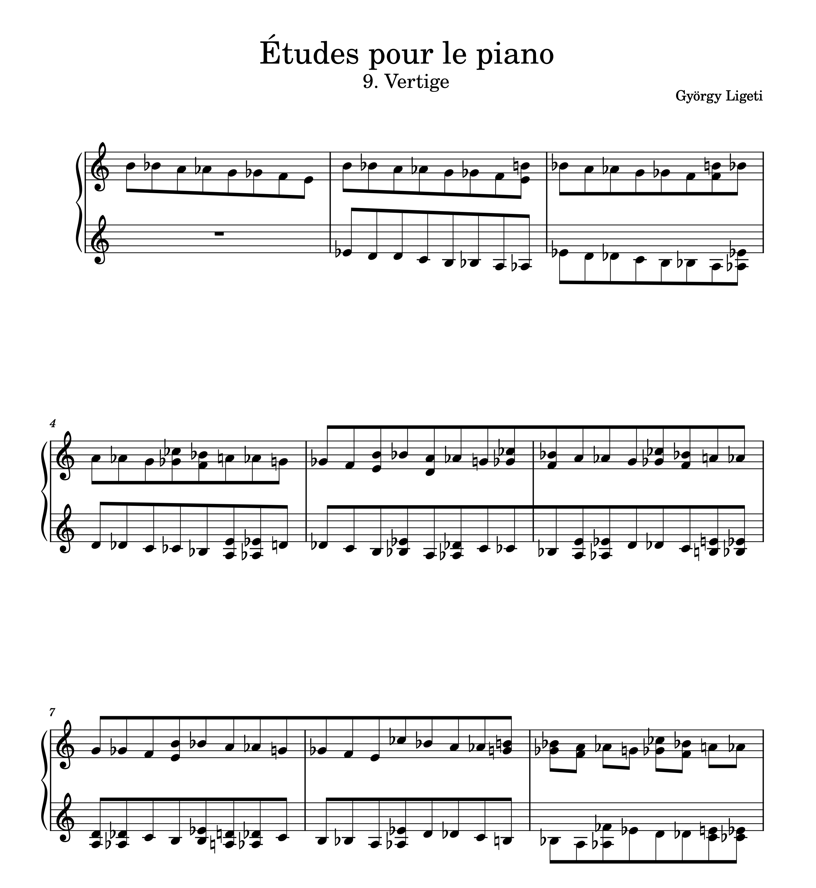

# György Ligeti

## _Études pour le piano_

Ligeti’s *Études pour le piano* are among the most influential and challenging pieces for piano in the late 20th century, pushing the boundaries of technique, rhythm, and harmonic language.

## About Ligeti
György Ligeti (1923–2006) was a Hungarian-Austrian composer, recognized as one of the most innovative and visionary figures in modern music. His compositions blend avant-garde experimentation with deeply expressive qualities, bridging traditional and contemporary approaches.

- [Timeline](#timeline)
- [Musical Style](#musical-style)
- [Key Features of Études](#key-features-of-études)
- [Detailed Analysis of Select Études](#detailed-analysis-of-all-études)
- [The Impact of Ligeti’s Études](#the-impact-of-ligetis-études)
- [Questions for Review](#questions-for-review)
- [Guides for Further Studies](#guides-for-further-studies)

  
## Timeline

| Year  | Event                                   | Description                                                   | Youtube |
|-------|-----------------------------------------|---------------------------------------------------------------|---------|
| 1923  | Birth                                  | Born on May 28, 1923, in Dicsőszentmárton, Romania            |         |
| 1945  | Early Music Studies                    | Studied composition in Budapest during WWII                   |         |
| 1956  | Emigration                             | Fled to Austria following the Hungarian Uprising              |         |
| 1960s | Avant-garde Recognition                | Rose to prominence with *Atmosphères* and *Lux Aeterna*       |         |
| 1985  | Études pour le piano (Books 1 & 2)     | Published the first two books of his groundbreaking études    | [Listen](https://youtu.be/XHhZ2TzHlow?si=a7cXXsXy0V7_3cJp) :tv:|
| 1994  | Études pour le piano (Book 3)          | Completed the third and final book of études                  |         |
| 2006  | Death                                  | Passed away on June 12, in Vienna, Austria                    |         |

Ligeti's *Études pour le piano* are renowned for their intellectual depth and technical brilliance.

## Musical Style
Ligeti’s style is characterized by:
- **Complex Rhythms**: Inspired by African polyrhythms and Conlon Nancarrow’s player piano studies.
- **Microtonality**: Use of dense harmonic textures and unconventional tuning systems.
- **Extended Techniques**: Exploring the physical and expressive limits of instruments.

Ligeti’s études combine these elements into a highly personal and innovative language.

## Key Features of Études
1. **Technical Challenge**: Requires virtuosity and advanced techniques.
2. **Harmonic Innovation**: Rich and unconventional harmonies.
3. **Rhythmic Intricacy**: Interlocking patterns and polyrhythms.
4. **Expressive Depth**: Balancing intellectual rigor with emotional resonance.

## Detailed Analysis of All Études

### Book I (1985)

#### Étude No. 1: *Désordre* (Disorder)
This piece explores rhythmic complexity, where the right hand accelerates while the left hand decelerates. The chaotic interplay between the hands creates a swirling, restless atmosphere, exemplifying the "disorder" of its title.

#### Étude No. 2: *Cordes à vide* (Open Strings)
Inspired by the resonance of open strings on string instruments, this étude uses harmonic overtones and pedal effects to evoke an ethereal and resonant sound world.

#### Étude No. 3: *Touches bloquées* (Blocked Keys)
This étude features the unique technique of “blocked keys,” where the pianist presses certain keys silently, creating muted and fragmented textures that challenge conventional piano sound.

#### Étude No. 4: *Fanfares*
This vibrant piece begins with bright, rhythmic motifs reminiscent of brass fanfares. It combines dynamic rhythmic drive with playful, exuberant melodic patterns.

#### Étude No. 5: *Arc-en-ciel* (Rainbow)
A lyrical and tender étude, this piece emphasizes flowing melodic lines and rich harmonic colors. The music evokes the shimmering, iridescent qualities of a rainbow.

#### Étude No. 6: *Automne à Varsovie* (Autumn in Warsaw)
This dramatic and powerful étude is one of the most challenging in the set, featuring relentless, cascading arpeggios and a hauntingly melancholic atmosphere.

### Book II (1988–1994)

#### Étude No. 7: *Galamb Borong* (Melancholic Pigeon)
A mysterious and introspective étude inspired by Ligeti’s memories of Hungarian folk music. The title reflects a gentle yet melancholic character.

#### Étude No. 8: *Fém* (Metal)
This étude explores metallic resonances and percussive attacks, creating a unique sound world that blends rhythmic precision with timbral experimentation.

#### Étude No. 9: *Vertige* (Vertigo)
A swirling, dizzying étude that features continuous, cascading scales in a hypnotic and disorienting flow. The effect is mesmerizing, resembling a spiraling descent.

#### Étude No. 10: *Der Zauberlehrling* (The Sorcerer’s Apprentice)
Inspired by Goethe’s poem and Dukas’s orchestral work, this étude combines playful rhythms with a sense of magical unpredictability.

#### Étude No. 11: *En suspens* (Suspended)
A calm and meditative étude that emphasizes silence and space, creating a suspended, almost otherworldly soundscape.

#### Étude No. 12: *Entrelacs* (Interlacing)
Complex polyrhythms intertwine in this étude, creating intricate textures and a sense of continuous motion.

### Book III (1994)

#### Étude No. 13: *L’escalier du diable* (The Devil’s Staircase)
One of Ligeti’s most famous études, this piece features relentless, ascending patterns that evoke the imagery of an endless staircase. It demands extreme stamina and technical mastery.

#### Étude No. 14: *Coloana infinită* (Infinite Column)
Inspired by Constantin Brâncuși’s sculpture of the same name, this étude creates a sense of infinite upward motion through its repetitive and evolving structures.

#### Étude No. 15: *White on White*
A study in subtlety and nuance, this piece focuses on delicate dynamics and sparse textures, evoking a minimalist aesthetic.

#### Étude No. 16: *Pour Irina*
Dedicated to Ligeti’s wife, Irina, this étude combines lyrical expressiveness with technical complexity, reflecting both tenderness and depth.

#### Étude No. 17: *À bout de souffle* (Out of Breath)
This étude captures a sense of urgency and exhaustion through its rapid, relentless rhythmic patterns, symbolizing the struggle to maintain momentum.

#### Étude No. 18: *Canon*
The final étude is a contrapuntal masterpiece, weaving intricate canonic lines that challenge both the performer’s technique and the listener’s perception.

## The Impact of Ligeti’s Études
Ligeti’s *Études pour le piano* stand as monumental works in the modern piano repertoire. They challenge pianists to rethink technique and musicality while inviting listeners into a world of boundless imagination and innovation.

> “These études are a crystallization of my inner world — part dream, part reality, and wholly human.” – György Ligeti

## Questions for Review

1. Which étude is called *Désordre* and is known for its chaotic rhythms?
   
Étude No. 1  

2. What special technique is used in *Touches bloquées* that blocks some piano keys?

Blocked keys  

3. Which étude is nicknamed *The Devil’s Staircase* because of its endless climbing patterns?
   
Étude No. 13 (*L’escalier du diable*)  

## Guides for Further Studies
**Ligeti’s Music**

Richard Steinitz’s *György Ligeti: Music of the Imagination* is a comprehensive resource for understanding Ligeti’s life, influences, and creative output.  

