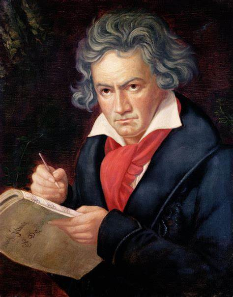
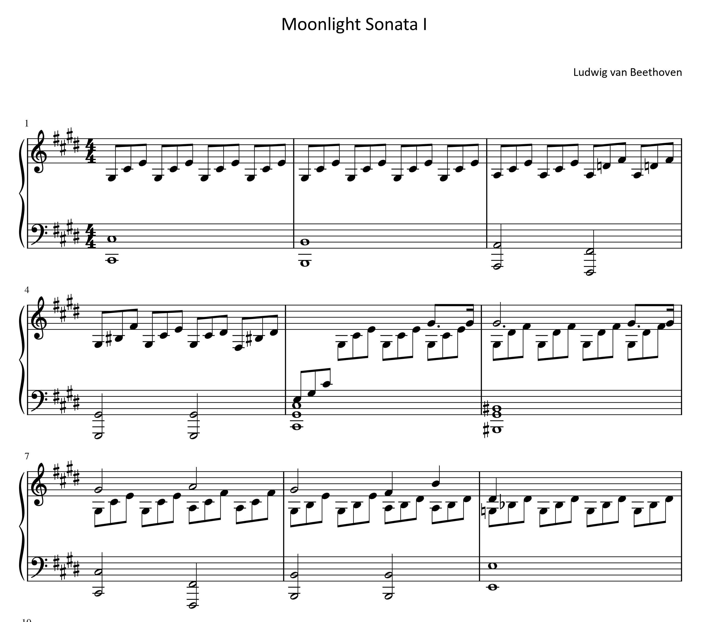

# Beethoven – Piano Sonata No. 14 in C♯ minor, Op. 27, No. 2 ("Moonlight Sonata")
## Composed: 1801
## Structure: 3 movements
## Duration: Approx. 15–20 minutes

- [Timeline](#timeline)
- [Piano Sonata No. 14 in C-Sharp minor, Op. 27, No. 2](#piano-sonata-no-14-in-c-sharp-minor-op-27-no-2)
  - [1st Movement – Adagio sostenuto](1st-movement-adagioasostenuto)
  - [2nd Movement – Allegretto](2nd-movement–allegretto)
  - [3rd Movement – Presto agitato](3rd-movement-presto-agitato)
- [Influences](#influences)
- [Listening Guide](#listening-guide)
- [Questions for Review](#questions-for-review)
- [Guides for Further Studies](#guides-for-further-studies)

---

## Timeline

**Ludwig van Beethoven** (1770-1827) is one of the most significant composers in the history of Western classical music.Despite his revolutionary contributions, his works were not always fully appreciated during his lifetime. Known for pushing the boundaries of classical form and expression, Beethoven's music reflects a deep emotional intensity, often born out of personal struggle. His later works, in particular, are characterized by a profound emotional depth and innovative approach to form.

*"Beethoven’s music activates fear, awe, horror, and suffering, awakening that “infinite longing” that defines the essence of Romanticism."(Hoffmann, 1813)*

| Year | Event | Description                                                                                                 | Youtube |
| ---- | ----- | ----------------------------------------------------------------------------------------------------------- | ------- |
| 1770 | Birth | Born on December 17th in Bonn, Electorate of Cologne (modern-day Germany).
| 1792 | Moves to Vienna | Moves to Vienna permanently to study with Joseph Haydn.
| 1795 | First public | First public performance in Vienna, showcasing his piano skills.
| 1800 | Composes symphony | Composes his first symphony, Symphony No. 1 in C major.                                         | [Youtube](https://www.youtube.com/watch?v=ouKhdyzxXE8)|
| 1801 | Hearing loss | Begins to experience the first signs of hearing loss.
| 1802 | Heiligenstadt Testament | Composes the "Heiligenstadt Testament," a letter expressing his despair over his deafness.
| 1812 | Composes sonata | Composes the "Waldstein" Piano Sonata and the "Appassionata" Sonata.                              | [Youtube](https://www.youtube.com/watch?v=efA1S8hyBms)|
| 1815 | Deaf | His hearing deteriorates significantly, and he becomes almost completely deaf.
| 1824 | Symphony No.9 Premiere | Premieres Symphony No. 9, including the famous "Ode to Joy" chorus.
| 1827 | Death | Dies on March 26th in Vienna at the age of 56.                                                              | [Youtube](https://www.youtube.com/watch?v=4IqnVCc-Yqo)|

This piece was directly influenced by Beethoven's piano sonatas, especially [Piano Sonata No.26](#beethoven-sonata-26.md) (This is not true.)

---
## Piano Sonata No. 14 in C-Sharp minor, Op. 27, No. 2 

This work is *Beethoven's Piano Sonata No. 14 in C♯ minor, Op. 27, No. 2*, commonly known as the **"Moonlight Sonata**."

In 1801, the year "Moonlight Sonata" was composed, Beethoven's hearing problems worsened, and his relationship with Giulietta Guicciardi faced difficulties. These personal struggles profoundly influenced his music, and "Moonlight Sonata" is one of the works where his emotions and turmoil are vividly expressed, earning it much admiration.

The title "Moonlight" was not given by Beethoven himself. It originated five years after his death when *Ludwig Rellstab* described the first movement as resembling **"a boat on the Lake Lucerne illuminated by moonlight."**

### 1st Movement – Adagio sostenuto

The first movement opens in C♯ minor and creates a deeply introspective and contemplative atmosphere. The movement deviates from traditional sonata form by using a single theme that is continuously varied, rather than presenting multiple contrasting themes. There are no dramatic tempo changes or modulations, which sets this movement apart from many of Beethoven's other works.

The instruction *"sostenuto"* (sustained) emphasizes that the notes should be played with deep expressiveness, allowing them to resonate fully. Beethoven further directs that the piece should be played *"Si deve suonare tutto questo pezzo delicatissimamente e senza sordini"* (very delicately and without the damper), which indicates a need for a soft, clear, and resonant sound. The music's simplicity allows the performer to focus entirely on expressing the deep emotions embedded in the piece, making this movement feel intimate, almost like an inner monologue.

### 2nd Movement – Allegretto

The second movement contrasts sharply with the first. It is lighter, more playful, and offers a brief respite from the intensity of the opening. This movement provides a sense of balance and acts as a kind of emotional relief before the stormy finale of the third movement. The clarity and charm of the Allegretto offer a moment of brightness, though it still retains an undercurrent of the piece's overall melancholy.

### 3rd Movement – Presto agitato

The third movement brings the sonata to a dramatic and intense conclusion. Marked Presto agitato, this movement is fast, forceful, and filled with energy. It contrasts with the meditative calm of the first movement and the lightness of the second, creating a sense of resolution and finality. The turbulent nature of the movement displays Beethoven's technical brilliance and emotional depth, offering a compelling and vigorous conclusion to the sonata.

**"Moonlight Sonata"** stands as a testament to Beethoven's ability to channel personal suffering into transcendent beauty. Through its simple yet powerful structure, it expresses an emotional range that has resonated with listeners for centuries. Despite the personal struggles Beethoven faced during its composition—most notably his increasing deafness—this sonata remains one of his most beloved and enduring works, demonstrating the enduring power of music to communicate universal human emotions.

This program note offers listeners a deeper understanding of the musical structure, emotional depth, and historical context of Beethoven's Moonlight Sonata, enhancing the listening experience and helping them connect with the piece on a more profound level.

## Influences

**1. Emotional Expression Evolution**
The "Moonlight Sonata" features emotional depth and introspective expression that were unprecedented in piano sonatas of its time. The first movement, with its gentle and lyrical atmosphere, conveys a sense of melancholy and inner turmoil, which may reflect Beethoven’s own struggles with his hearing loss and personal challenges. This sonata represents a new level of personal, inward emotional expression, opening up a new dimension in how emotions were portrayed in music.

**2. Challenge to Traditional Sonata Form**
This sonata deviates from the traditional three-movement sonata form, offering a more non-traditional structure. The first movement is extremely slow and lyrical, which presents a new approach to sonata form. This challenge to the conventional structure paved the way for later composers to experiment with and break free from traditional forms, particularly those in the Romantic period.

## Listening Guide
[Evgeny Kissin](https://www.youtube.com/watch?v=r4v_XP0BTdU) Kissin's performance is characterized by his exceptional technique and unique musicality. In particular, his ability to execute the fast tempo of the third movement is the most notable aspect of his interpretation.

[LimYunChan](https://www.youtube.com/watch?v=JiK00v4FrHA) Despite his young age, Lim Yun-chan has expressed the music of Moonlight in his own unique style, and his extraordinary technique, which is truly remarkable, stands out.

[Valentina Lisitsa](https://www.youtube.com/watch?v=ITidiBe-0T0) She has always been known for her exceptional technique, and her light touch is considered her signature. When you listen to her, you will be continually amazed. Not only does she play with a feather-light touch even at fast tempos, but her unique tone, which stands out in both the first and second movements, plays the most important role in interpreting the music.

## Questions for Review
- Why was this sonata named "Moonlight"?
- What is the form of the 3rd movement of the Moonlight Sonata?
- Which movement of the Moonlight Sonata was the most impressive to you? What is the reason?

## Guides for Further Studies
For additional information, it would be helpful to refer to this literature. (https://www.riss.kr/link?id=A107044246)
