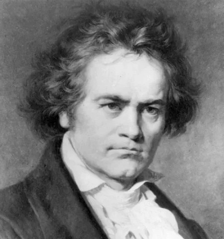

# Ludwig van Beethoven (1770-1827)
## Piano Sonata No. 21 in C major, Op. 53, "Waldstein"

**Ludwig van Beethoven (1770–1827)** was a German composer and pianist, who was an important figure between classicism and romanticism. His music is known for its depth of emotion and innovative structures. 
Beethoven composed nine symphonies, many piano sonatas, chamber music, and especially his fifth and ninth symphonies (choral symphonies) occupy very important positions in the history of music. He continued to work in art even when he was losing his hearing, establishing a creative style that pushed the limits of music. 
Beethoven emphasizes the individual expressions of artists, and his music is still loved by many around the world.

Beethoven's Sonata "Waldstein" shows innovation and originality in the sonata form, making it suitable for discussing Beethoven's musical development. And the way he effectively communicates emotions through contrasting themes provides a rich discussion of musical interpretation. Because of these factors, "Waldstein" is a highly interesting and educational value for presentation topics.Also, it was my college entrance song and I've been studying this song for a long time, so I think it's perfect for selecting this work.

---

# Ludwig van Beethoven: Piano Sonata No. 21 in C major, Op. 53 ("Waldstein")

**Composition Date**: 1803–1804  
**Premiere**: 1806  
**Dedication**: Count Ferdinand von Waldstein

---

- [Timeline](#timeline)
- [Overview](#overview )
- [Structure](#structure)
- [Musical Significance](#musical-significance)
- [Conclusion](#conclusion)
- [Influences](#influences)
- [Significance](#significance)
- [Performance and Reception](#performance-and-reception)
- [Questions for Review](#questions-for-review)
- [Guides for Further Studies](#guides-for-further-studies)

  

---

# TimeLine

| Year | Event                        | Description                                                                         | Youtube |
| ---- | ---------------------------- | ----------------------------------------------------------------------------------- | ------- |
| 1770 | Birth in Bonn                | Born  on December 16, 1770 in Germany                                               |
| 1787 | First Visit to Vienna        | Visited Vienna, reportedly met Mozart                                               |
| 1792 | Move to Vienna               | Moved to Vienna, studied composition with Haydn                                     |                                                 
| 1800 | First Symphony               | Published his First Symphony, gaining recognition as a composer                     | [Listen No.1](https://www.youtube.com/watch?v=ouKhdyzxXE8&t=373s) :tv: |
| 1803 | The Eroica Symphony          | Composed Symphony No. 3 *"Eroica"*                                                  | [Listen No.3](https://www.youtube.com/watch?v=I9HapWc4mr4) :tv:                                                 |
| 1808 | Fate and Pastoral Symphonies | Premiered Symphony No. 5 *"Fate"* and No. 6 *"Pastoral"*                            | [Listen No.5](https://www.youtube.com/watch?v=NWWbA5H5pEs) :tv: , [Listen No.6](https://www.youtube.com/watch?v=y-6B1z5spOY) :tv: |
| 1815 | Custody Battle               | Following his brother's death, began a legal battle for custody of his nephew, Karl |  
| 1824 | Symphony No. 9               | Presented Symphony No. 9 *"Choral"*, considered a masterpiece                       | [Listen No.9](https://www.youtube.com/watch?v=acmy-daxIZk) :tv:                                                 |
| 1827 | Death in Vienna              | Died in Vienna at the age of 56                                                     |

---

 
 

---

# Overview 

Beethoven's Piano Sonata No. 21 in C major, Op. 53, commonly known as the "Waldstein" Sonata, stands as one of his most celebrated and technically demanding works. Composed between 1803 and 1804, it reflects the composer’s growing mastery of the piano and his transition from the Classical style to his more distinctive, emotionally expressive Late-Style. The title "Waldstein" is a tribute to Beethoven’s patron and friend, Count Ferdinand von Waldstein, who had been a significant supporter of the composer’s early career and was instrumental in securing him a place in Vienna's musical world.

The sonata is notable for its grandeur and its innovative departure from the conventions of the Classical sonata form. The work challenges both the performer and the listener with its dynamic range, emotional depth, and technical complexity. The “Waldstein” Sonata encapsulates Beethoven’s ambition to transcend the limits of the piano, using it as a medium not just for expression, but for philosophical and emotional exploration.

---

# Structure

The Sonata is in three movements:

1. **Allegro con brio**
2. **Adagio un poco mosso**
3. **Allegro molto**

---

### **1. Allegro con brio**

The first movement opens with a bold, energetic theme that sets the tone for the entire work. "Allegro con brio" translates to "lively and with spirit," and this movement brims with excitement, its driving rhythms and powerful accents immediately capturing the listener’s attention. The main theme, a forceful and rhythmic motif, is introduced in the right hand and is later echoed by the left. The thematic material is developed in complex counterpoint, showcasing Beethoven’s ability to blend lyricism with powerful momentum. 

This movement is a tour de force of technical brilliance, where Beethoven explores both rapid figurations and expansive arpeggios, demanding both precision and emotional intensity from the pianist. The contrast between the main theme's intensity and the more lyrical second subject creates a sense of dramatic tension, resolved through the recapitulation and the climactic return of the opening material.

**Key Features**:
- **Rhythmic drive**: The movement is propelled by vigorous and syncopated rhythmic patterns.
- **Thematic development**: Beethoven continuously manipulates the themes, providing an ever-evolving sense of drama.
- **Technical challenges**: Rapid scales, wide leaps, and intricate passagework define the movement’s virtuosic character.
[I think this key features points are not necessary in program notes, instead, you should incorporate it into the paragraphs]
---

### **2. Adagio un poco mosso**

The second movement, “Adagio un poco mosso,” offers a striking contrast to the first. It is a slow and meditative piece, filled with introspective depth. The lyrical opening theme is carried in long, flowing lines that seem to drift between the hands, allowing for expansive, expressive phrasing. The movement is imbued with a sense of quiet grandeur and emotional subtlety, highlighting Beethoven’s ability to evoke a range of feelings with spare, simple textures.

Though calm on the surface, the movement subtly shifts through various harmonic and thematic ideas, demonstrating Beethoven’s innovation within a slower, more reflective context. There is a growing intensity, especially in the middle section, where rapid and passionate flourishes begin to emerge before subsiding into the calm, contemplative atmosphere.

**Key Features**:
- **Expressive lyricism**: The movement’s long, singing lines invite the performer to focus on subtle phrasing and dynamic shading.
- **Harmonic richness**: Beethoven employs chromaticism and shifting harmonies, creating a sense of emotional depth.
- **Contrast**: The movement provides a dramatic and thematic respite from the brilliance of the first, with a more personal and intimate character.
[I think this key features points are not necessary in program notes, instead, you should incorporate it into the paragraphs]
---

### **3. Allegro molto**

The final movement bursts forth with an exuberant and energetic spirit. “Allegro molto” (very fast) is a lively, joyful conclusion that contrasts sharply with the introspective second movement. The movement is characterized by its rapid, rhythmic patterns, as well as the playful dialogue between the hands. The opening theme is expansive and playful, and Beethoven's exploration of its thematic material through frequent variations creates a sense of continuous motion.

As in the first movement, Beethoven takes full advantage of the piano’s potential for virtuosic passagework, with fast runs, brilliant scales, and wide leaps. The playful, almost mischievous character of this movement is accentuated by surprising harmonic shifts and sudden dynamic changes, keeping the listener on edge as it builds toward a rousing finale. 

**Key Features**:
- **Rhythmic drive**: The movement features fast, alternating rhythms and rapid passages that require both speed and precision.
- **Light-hearted energy**: Despite its technical demands, the movement conveys a sense of joy and optimism.
- **Exuberant ending**: The movement concludes with a triumphant flourish, bringing the sonata to a brilliant close.
[I think this key features points are not necessary in program notes, instead, you should incorporate it into the paragraphs]
---

# Musical Significance

The "Waldstein" Sonata marks a significant turning point in Beethoven’s career, showcasing his move toward greater freedom in musical expression and formal structure. In its monumental scope, the sonata combines the Classical elegance of Mozart and Haydn with Beethoven's emerging Romantic style, marked by greater emotional depth and complexity. The first movement’s grandiose opening and virtuosic demands push the boundaries of what was expected from a piano sonata at the time, while the final movement’s joyful energy brings the work to an exhilarating conclusion.

Beethoven’s innovation is evident in the way he manipulates form. While adhering to the basic structure of a sonata, he plays with thematic development and emotional contrast, ensuring that each movement has a distinct character while maintaining a cohesive sense of unity throughout. His use of harmonic experimentation, complex counterpoint, and orchestral textures for the piano set the stage for the dramatic, more expansive works that would follow in his late period.

---

# Conclusion

The "Waldstein" Sonata is a stunning demonstration of Beethoven’s genius, marked by its boldness, innovation, and emotional depth. With its striking contrasts between the vigorous and the lyrical, the playful and the profound, it is a work that encapsulates the essence of Beethoven's style: a fearless exploration of the piano’s capabilities, imbued with an intensely personal expression. As one of his most iconic piano works, the "Waldstein" Sonata remains a cornerstone of the piano repertoire, continuously inspiring performers and listeners alike.

---

## Influences   
**Beethoven's Piano Sonata No. 21 "Waldstein" (Op. 53)** is an innovative work that goes beyond traditional sonata form, containing a grand structure and emotional depth that had a significant impact. The sonata attempts a bold departure from traditional sonata form by using an expansive structure, which influenced the composition of later sonatas. It also expresses deep and complex emotions, further emphasizing Beethoven's inner emotional world and expression. Technically, the piece is highly challenging, with complex passages and rapid tempos, expanding piano technique and introducing new methods of playing. Harmonically, it moves beyond traditional harmony, showing an innovative approach that influenced future composers. "Waldstein" served as an important inspiration for later composers such as Chopin, Liszt, and Brahms, and stands as a key milestone in the development of modern piano sonatas.

## Significance

**Beethoven's Piano Sonata No. 21 "Waldstein" (Op. 53)** is a significant milestone in the history of classical music. It marks an important turning point in Beethoven's compositional style, demonstrating an innovative approach that goes beyond traditional sonata form, both structurally and emotionally. The sonata's bold structural expansion helped advance the sonata genre and influenced later sonata compositions.

"Waldstein" combines remarkable technical demands with deep, complex emotional expression, presenting a significant challenge to pianists. The piece requires fast, intricate passages and powerful energy, yet also features lyrical and introspective moments, showcasing Beethoven's ability to convey profound emotional depth. This emotional richness reflects Beethoven's desire to express his unique inner world through music.

Additionally, the sonata is innovative in its harmonic and thematic development. It moves beyond traditional harmonic progressions, exploring new sound textures, which had a significant influence on later composers like Chopin, Liszt, and Brahms. "Waldstein" is not just a piano sonata but a key contribution to the evolution of piano music, solidifying its place as an important work in Beethoven's oeuvre.

## Performance and Reception

Beethoven's Piano Sonata No. 21 "Waldstein" (Op. 53) was first performed in 1804, at a time when Beethoven had already gained recognition for his unique compositional style. The sonata drew attention for its bold structure and innovative musical language, marking an important development in his work.

### Performance and Reception:

1. **Initial Reception**  
   At its premiere, "Waldstein" was well-received by the audience, largely due to its grand scale and Beethoven's growing reputation. The sonata's bold structure, dramatic energy, and lyrical moments left a strong impression. However, the technically complex passages may have posed challenges for performers of the time.

2. **Critical Acclaim**  
   Critics appreciated the sonata for its innovative qualities, particularly how Beethoven expanded the traditional sonata form and broadened emotional expression. It was praised for its balance of dramatic intensity and lyrical moments, and recognized as a key work that showcased Beethoven’s mature style and innovation within the sonata genre.

3. **Long-term Reception**  
   Over time, "Waldstein" became one of Beethoven's most celebrated piano works. It has solidified its place as a core piece in the standard piano repertoire and is frequently performed in concert halls worldwide. The sonata’s influence on later composers and its role in the development of the piano sonata genre have ensured its lasting significance in classical music.

In conclusion, while the "Waldstein" Sonata initially posed technical challenges for performers, it was quickly recognized for its innovation and emotional depth. Today, it remains an essential work in the piano repertoire and a cornerstone of Beethoven's legacy.

## Questions for Review

Here are some questions to consider when reviewing Beethoven's Piano Sonata No. 21 "Waldstein" (Op. 53):

1. **Compositional Techniques**: What innovative compositional techniques does Beethoven use in "Waldstein," and how do they differentiate this sonata from his earlier works?

2. **Structural Analysis**: How does Beethoven expand on the traditional sonata form in "Waldstein"? What is the significance of the sonata's large-scale structure, particularly in the first and third movements?

3. **Emotional Expression**: How does Beethoven balance dramatic intensity with lyrical moments in the sonata? What does this tell us about his emotional expression and artistic development at the time?

4. **Technical Demands**: What are the key technical challenges posed by this sonata for pianists, and how do these challenges contribute to the overall impact of the work?

5. **Harmonic and Thematic Development**: How does Beethoven explore harmonic and thematic development in "Waldstein"? What role do dissonance and harmonic innovation play in the sonata?

6. **Influence on Later Composers**: How did "Waldstein" influence later composers, particularly in terms of piano technique and sonata composition?

7. **Performance Interpretations**: How might different pianists interpret the "Waldstein" Sonata? What are the key interpretative decisions a performer must make when approaching this work?

8. **Historical Context**: What was the reception of the sonata at its premiere, and how did it fit into the larger context of Beethoven's work during this period?

These questions will help you engage deeply with the piece, analyzing both its technical details and its broader artistic significance.

## Guides for Further Studies

 **Guide for Further Study of Beethoven's Piano Sonata No. 21 "Waldstein":**

1. **Analysis of Composition Techniques and Structure**: Analyze the expansion of sonata form and theme development. Look at the two contrasting themes in the first movement, the lyrical elements in the second, and the lively nature of the third movement.

2. **Emotional Expression and Interpretation**: Consider how to balance the dramatic sections and lyrical moments. Listen to different interpretations by various pianists and reflect on how they approach the piece.

3. **Technical Challenges**: Practice fast passages, complex harmonies, and independent hand movements. Focus especially on playing fast tempos and executing delicate passages with precision.

4. **Historical Context**: Understand how "Waldstein" marks a turning point in Beethoven's music and how it influenced later composers.

5. **Critical Analysis**: Compare early reviews of the piece with modern critiques and explore how performers have evolved their interpretations over time.

6. **Performance and Practice**: Observe live performances, develop your own interpretation, and solidify your understanding through practice and performance.

This guide will help you efficiently study the key elements of the "Waldstein" Sonata, deepening your understanding of the work.

---

That's cool. 

It's a great textbook.
