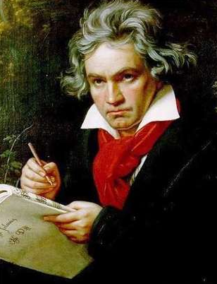
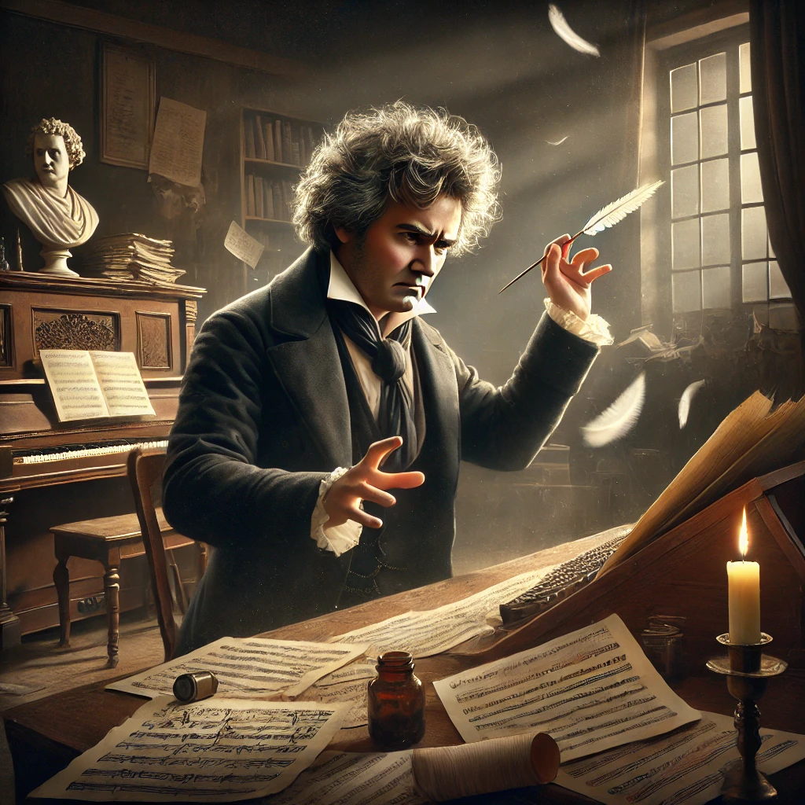
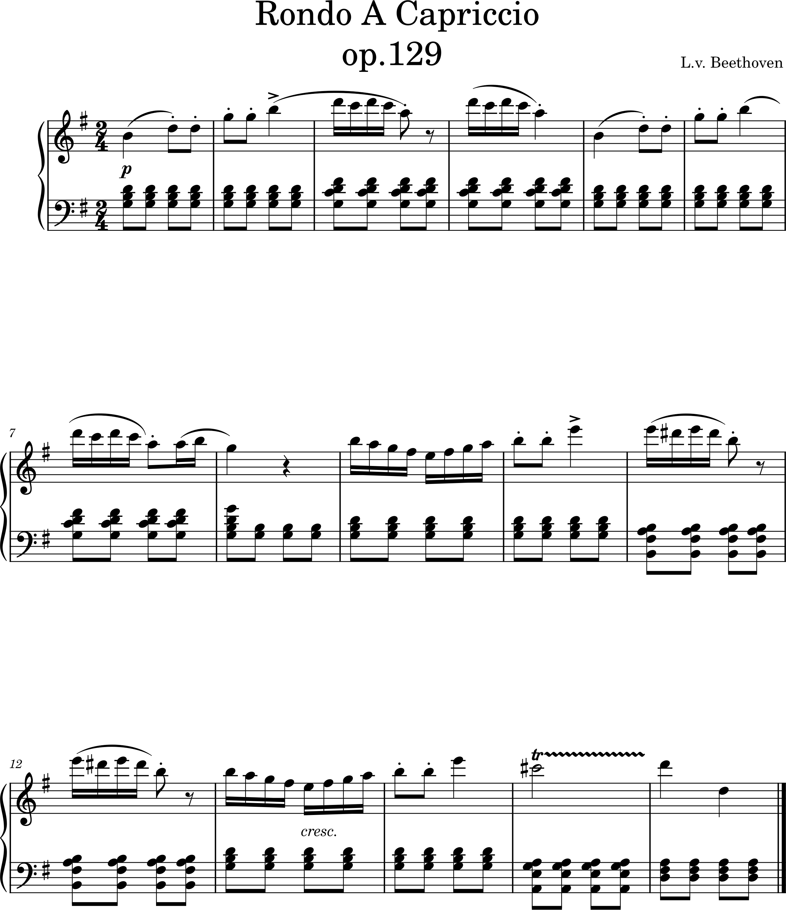

# L.v.Beethoven

- [Timeline](#timeline)
- [Rondo a carpriccio Op.129](#rondo_a_carpriccio_op_129)
  - [Introduction](#introduction)
  - [Structure and Characteristics](#structure_and_characteristics)
  - [Musical Character](#musical_charater)
  - [Points to Listen For](#points_to_listen_for)
  - [Conclusion](#conclusion)
- [Timeline](#timeline)
- [Questions for Review](#questions_for_review)
- [Guides for Further Studies](#guides_for_further_studies)

## Timeline

|Year|Event                   |Description                                                         |YouTube|
|----|------------------------|--------------------------------------------------------------------|-------|
|1770|Birth                   |Born on December 17 in Bonn, Germany                                |       |
|1778|First Public Performance|Beethoven had his first performance at the age of 7                 |       |
|1792|Move to Vienna          |Learning from Haydn, vowing the foundation of a composer and pianist|       |
|1801|Deafness Begins         |Beethoven began to suffer severe hearing loss                       |       |
|1810|Für Elise               |Beethoven composed the beloved piano piece Bagatelle in A Minor     |[Watch](https://www.youtube.com/watch?v=n4YZKJQKFFk)|
|1827|Death                   |Beethoven passed away on March 26 in Vienna at the age of 56        |       |

## Rondo a carpriccio Op.129

### Introduction

Beethoven's Rondo a Capriccio, Op. 129, is a lively and humorous piece that stands out among his works for its playful character. Commonly known as "Rage Over a Lost Penny," this nickname was not originally given by Beethoven but aptly describes the piece's whimsical and spirited nature.

The piece is believed to have been composed between 1795 and 1798, reflecting Beethoven's early style, though it was published posthumously in 1828. The nickname was reportedly assigned by Anton Schindler, a close friend of Beethoven and an early biographer who helped publish many of his works.

### Structure and Characteristics

This piece follows a rondo form, where a vivacious main theme alternates with contrasting episodes.

Theme: The playful and frantic opening theme immediately sets the tone, evoking the imagined "rage" of searching for a lost penny. This theme recurs throughout the piece, creating a sense of familiarity.
Episodes: Interspersed between the reprises of the main theme are brilliant and contrasting passages, often showcasing virtuosic piano techniques. These episodes reflect Beethoven's prowess as a pianist and his intention to highlight technical brilliance.
Transitions: Dramatic transitions add tension to the piece, contrasting with the humorous and lighthearted main theme, keeping the audience engaged.

### Musical Character

The Rondo a Capriccio reveals Beethoven's sense of humor and playful creativity, contrasting sharply with the serious and monumental works of his later years. Its fast tempo, energetic rhythms, and surprising twists make it an engaging and dynamic composition.

### Points to Listen For

Humor and Whimsy: Despite the "rage" implied in the title, the piece exudes charm and wit, presenting an almost comical narrative.
Pianistic Brilliance: The rapid scales, sparkling embellishments, and technical demands highlight the pianist's virtuosity.
Expressive Depth: Beyond technical proficiency, performers must capture the lighthearted energy, shifting tensions, and vivid character of the piece.

### Conclusion

Beethoven's Rondo a Capriccio is a gem that offers a glimpse into the composer's human side and his playful artistry. Performers have the chance to convey Beethoven's humor and vitality, while audiences are invited to enjoy a delightful exploration of his unique musical imagination.

## Questions for Review

- When was Beethoven's Rondo a Capriccio composed, and why was it published posthumously?
- Who assigned the nickname Rage Over a Lost Penny, and what does it signify about the character of the piece?
- What is a rondo form, and how is it exemplified in this piece?
- How do the episodes differ from the main theme in mood and technical elements?
- What are the key technical demands of the piece for pianists?

## Guides for Further Studies

Study the rondo form in the works of Mozart and Haydn. How does Beethoven's approach differ in terms of energy and humor?
Analyze other compositions where Beethoven's humor and wit are evident, such as his Scherzos. What techniques does he use to convey these qualities?
Read Anton Schindler’s biography of Beethoven to gain insight into the composer’s personality and how Schindler’s interpretations have shaped our understanding of works like this one.

