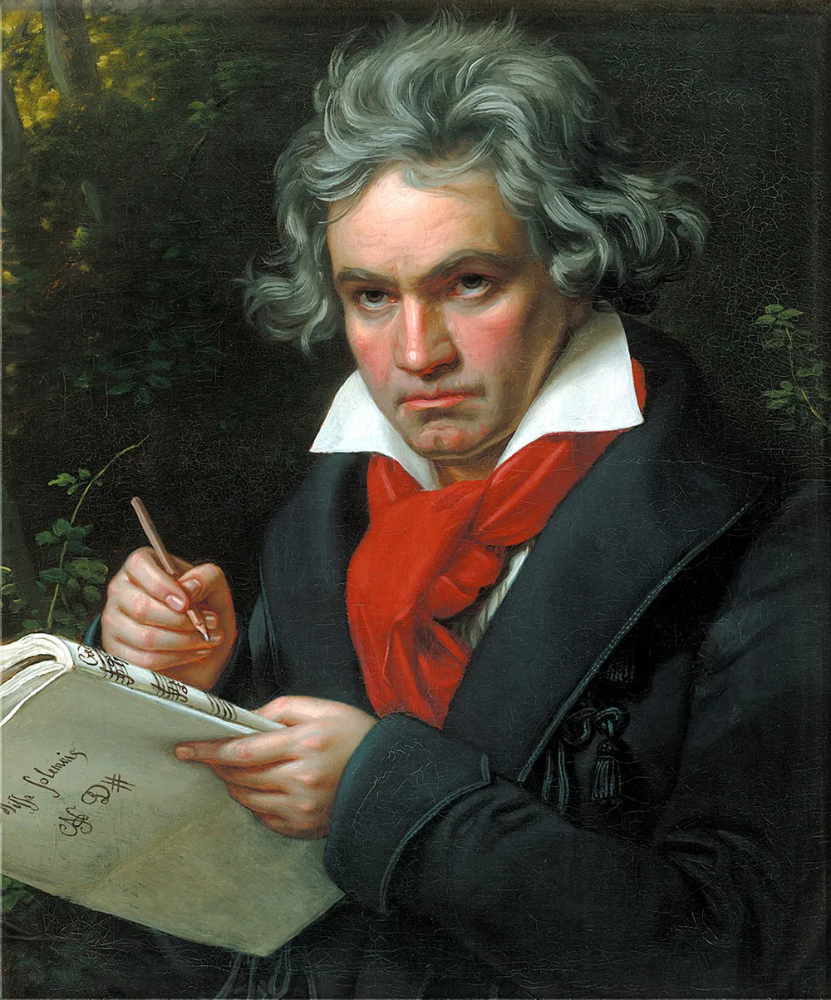
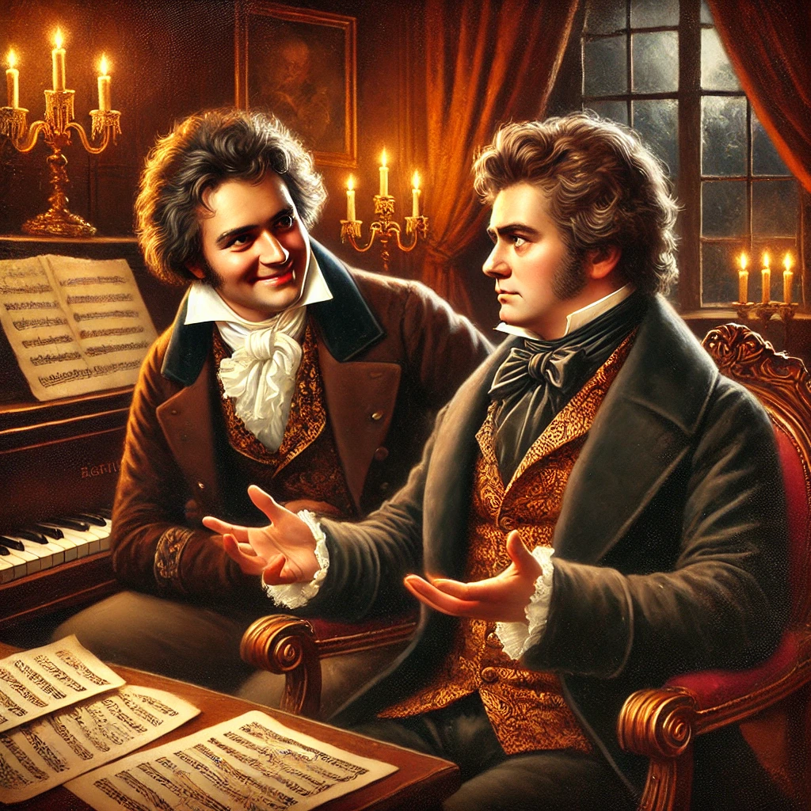
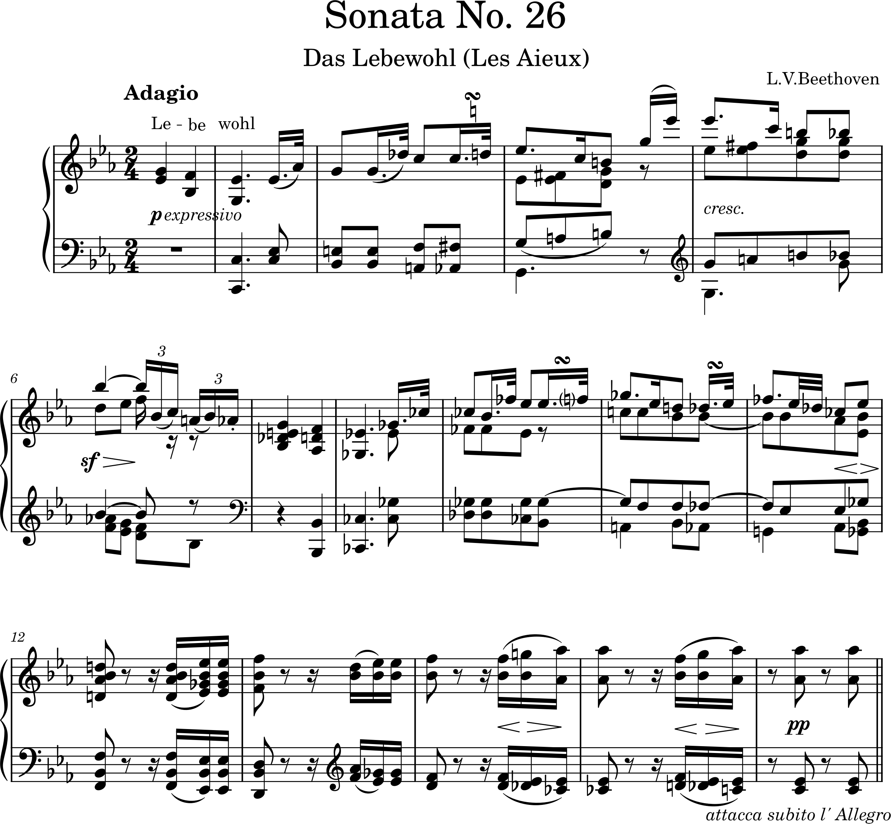

# Ludwig van Beethoven (1770–1827)

**Ludwig van Beethoven (1770-1827)** was a German composer and pianist who served as a crucial link between the Classical and Romantic eras, expanding the traditions of Mozart and Haydn while developing his own bold and deeply expressive style. His music, characterized by innovation and emotional depth, includes iconic works such as his symphonies, piano sonatas, and string quartets, with Symphony No. 9 standing as a timeless celebration of humanity and peace. Despite losing his hearing in his mid-30s, Beethoven produced some of his most profound compositions, using music to explore the human condition, ideals of freedom, and the social and political issues of his time, leaving an indelible mark on music history.

---

- [Timeline](#timeline)
- [Piano Sonata No. 26 in E-flat major, Op. 81a, “Das Lebewohl"](#piano-sonata-no-26-in-e-flat-major-op-81a-das-lebewohl)
  -  [Movement I: “Das Lebewohl” (The Farewell)](#movement-i-das-lebewohl-the-farewell)
  -  [Movement II: “Die Abwesenheit” (The Absence)](#movement-ii-die-abwesenheit-the-absence)
  -  [Movement III: “Das Wiedersehen” (The Return)](#movement-iii-das-wiedersehen-the-return)
- [Questions for Review](#questions-for-review)
- [Guides for Further Studies](#guides-for-further-studies)

---

## Timeline

| Year | Event | Description | Youtube |
| ---- | ----- | ----------- | ------- |
| 1770	| Birth	| Ludwig van Beethoven was born in Bonn, Germany. |
| 1787	| Meets Mozart	| Traveled to Vienna and briefly met Wolfgang Amadeus Mozart, who praised his talent. |
| 1792	| Moves to Vienna	| Beethoven moved to Vienna to study with Joseph Haydn and pursue his musical career. |
| 1800	| Hearing loss begins	| Beethoven begins to experience hearing loss, leading to significant emotional challenges. |
| 1802	| Heiligenstadt Testament	| Wrote a letter expressing despair over his worsening hearing loss. |
| 1809	| Archduke Rudolph flees	| Napoleon invades Vienna, forcing Beethoven's patron, Archduke Rudolph, to leave. Beethoven begins composing Piano Sonata No. 26 for him. |
| 1810	| Completes Piano Sonata No. 26	| Piano Sonata No. 26 'Les Adieux' (Op. 81a) is published, featuring three narrative movements about farewell, absence, and reunion with Archduke Rudolph. |
| 1810	| Publishes Sonata No. 26	| Piano Sonata No. 26 was published, reflecting themes of farewell, absence, and reunion. | [Listen](https://youtu.be/6c9B3K4ii-c?si=PcrhJ5FE2cs3OTSn) :tv: |
| 1824	| Symphony No. 9 Premiere	| Beethoven conducted the first performance of his Ninth Symphony despite being deaf. |
| 1827	| Death	| Beethoven passed away in Vienna, Austria. |

---

## Piano Sonata No. 26 in E-flat major, Op. 81a, “Das Lebewohl”

### Introduction
**Ludwig van Beethoven’s Piano Sonata No. 26**, also known as *“Das Lebewohl”* or *“Les Adieux,”* holds a unique place in his oeuvre, embodying personal and historical significance. This sonata is one of the few works where Beethoven himself assigned a programmatic title, revealing his deep attachment to his student and friend, Archduke Rudolph. Composed during a tumultuous time when Vienna was under siege by Napoleon’s forces, the piece reflects themes of farewell, absence, and reunion—capturing Beethoven’s emotions as he bid goodbye to the Archduke, who had to flee Vienna amidst the conflict.

  
  
<em>Ludvig van Beethoven (left) and Archduke Rudolph (right).</em>

### The Sonata’s Background and Structure
Completed between 1809 and early 1810, this sonata is organized into three movements, each marked with German titles that convey the progression of emotions associated with departure and return. Beethoven expressed frustration when the French publisher later altered these titles to the French equivalents, feeling that they lost the intimate nuance of the original German phrases.

 #### Movement I: “Das Lebewohl” (The Farewell)
 
Opening with a poignant Adagio introduction, Beethoven illustrates the pain of parting through descending motifs that echo the syllables of “Lebewohl” (farewell). The heavy, sustained chords and solemn intervals convey a sense of loss and separation. As the Allegro section unfolds, Beethoven introduces moments of agitation, capturing the tension of the farewell.

 #### Movement II: “Die Abwesenheit” (The Absence)
 
The second movement, marked Andante espressivo, portrays a quiet, reflective sorrow. Here, Beethoven captures the loneliness and longing that follows the Archduke’s departure. The music becomes introspective, with simple, flowing lines that feel suspended in time, evoking a sense of waiting and contemplative solitude.

 #### Movement III: “Das Wiedersehen” (The Return)
 
Marked Vivacissimamente, the final movement bursts forth with jubilant energy, celebrating the Archduke’s return. Beethoven’s music conveys an undeniable joy, marked by lively, rhythmic motifs and exuberant passages that reflect the excitement of reunion. This final movement is an exuberant release, rounding off the sonata on a note of optimism and restored connection.

### Conclusion
Beethoven dedicated this sonata to Archduke Rudolph, whose patronage and friendship provided the composer with vital support. Beyond its historical context, the work embodies universal emotions of parting and reunion, translating personal experience into a profoundly moving musical narrative. As such, Das Lebewohl offers listeners a unique glimpse into Beethoven’s capacity to blend personal emotion with his innovative musical style, making it one of the most expressive and narrative-driven sonatas in the classical repertoire.

---

## Questions for Review
1. Who did Beethoven dedicate Piano Sonata No. 26 to?
2. What words do the opening notes of the first movement represent?
3. How does the second movement describe the absence of Archduke Rudolph?
4. What feeling is shown in the lively third movement?
5. Why was this sonata written during Napoleon’s invasion of Vienna?

---

## Guides for Further Studies
**1. Analysis of the Sonata's Structure and Emotional Narrative**
   
Explore an in-depth breakdown of the three movements (*Das Lebewohl*, *Abwesenheit*, *Das Wiedersehen*) that detail Beethoven's storytelling through music. The narrative elements of farewell, absence, and joyous reunion are expressed with unique motifs, harmonic shifts, and emotional dynamics.  
- [Beethoven's Op.81a analysis - MTO](https://www.mtosmt.org/issues/mto.96.2.4/mto.96.2.4.agmon.html)

**2. Historical and Biographical Context**
   
Delve deeper into Beethoven's life and the historical events he lived through, providing a richer understanding of his music and its emotional depth.  
- [Ludvig van Beethoven - Britannica](https://www.britannica.com/biography/Ludwig-van-Beethoven)

**3. Performance Insights**

Understand the nuances of *Les Adieux* by listening to interpretations from renowned pianists. This can provide insight into the different ways the sonata's emotional and technical challenges are approached.  
- [Daniel Barenboim's performance - YouTube](https://youtu.be/K-ChTHM9B2w?si=UUu1wgVFA_I7gRtz)
