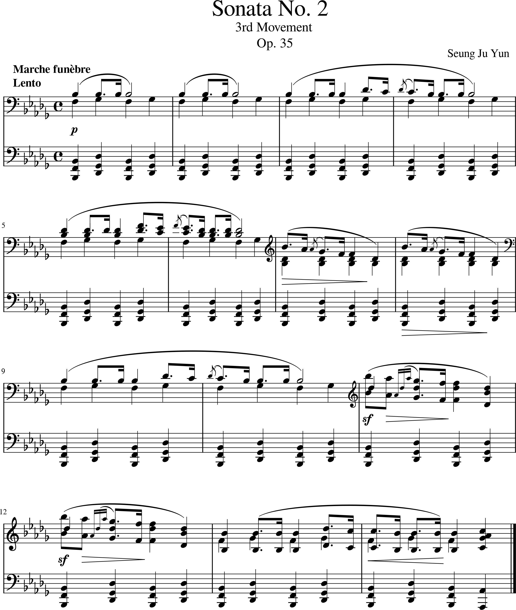

# Chopin sonata no.2

- [Piano sonata in b flat minor Op.35](#piano-sonata-in-b-flat-minor-op-35)
- [Influences](#influences)
- [Significance](#significance)
- [Performance and Reception](#performance-and-reception)
- [Listening Guide](#listening-guide)

## Timeline

|Year|Event      |Description                                             |YouTube|
|----|-------------------|------------------------------------------------|-------|
|1810|Birth              |Born on March 10 1810 in Żelazowa Wola, Poland  |       |
|1817|first composition  |Composing first work at the age of seven        |       |
|1826|Entrance to school |Study at Warsaw Conservatory                    |       |
|1838|Prelude Composition|24 famous Prelude compositions                  |[Watch](https://www.youtube.com/watch?v=SqXYIteAfNs)       |
|1849|Death              |Death from tuberculosis in Paris                |       |

## Piano Sonata in b flat minor Op. 35 

Frédéric Chopin’s Piano Sonata No. 2 in B-flat minor, Op. 35 is a towering masterpiece of the Romantic era, blending profound emotion with technical brilliance. Composed in 1839 during a particularly reflective period in Chopin’s life, the sonata is widely known for its third movement, the Marche funèbre (Funeral March). This iconic movement has become synonymous with themes of mourning and loss, making the work one of Chopin’s most enduring compositions.

The sonata showcases Chopin’s innovative approach to traditional forms. While he retained the four-movement structure of the classical sonata, Chopin infused each section with his distinctive harmonic language and unparalleled ability to evoke emotion. From the dark intensity of the first movement to the enigmatic conclusion of the finale, the work is a deeply personal exploration of life, death, and memory.

Movement I: Grave – Doppio movimento
The opening movement begins with dramatic, almost foreboding chords, establishing a tone of weighty seriousness. The main section unfolds with passionate, sweeping phrases, alternating between turbulent outbursts and lyrical passages. The contrasts within this movement reflect Chopin’s mastery of emotional depth, inviting the listener into a journey of introspection and intensity.

Movement II: Scherzo
In stark contrast to the gravity of the first movement, the second movement is lively and effervescent, characterized by rapid runs and playful melodies. Despite its lighter tone, moments of shadow and tension weave through the piece, creating a complex interplay of joy and unease.

Movement III: Marche funèbre: Lento
The Funeral March is the heart of the sonata and arguably one of Chopin’s most recognizable works. The slow, steady rhythm of the opening evokes the solemnity of a funeral procession, while the poignant melody captures a universal sense of grief. In the middle section, Chopin offers a lyrical contrast—an ethereal and tender passage that recalls memories of gentler times. The march returns, closing the movement with a sense of finality and profound sorrow.

Movement IV: Finale: Presto
The sonata concludes with a whirlwind of restless energy in the Finale. This brief but intense movement is marked by a lack of a clear melodic theme, instead relying on rapid, stormy passages that seem to swirl into chaos. The haunting, unresolved conclusion leaves listeners with a sense of mystery, as if the music fades into the void, embodying the inevitable silence after life's struggles.

Legacy : 
Upon its premiere, Chopin’s Piano Sonata No. 2 garnered mixed reactions, with some critics questioning its structure. However, it has since been recognized as a masterpiece, celebrated for its emotional depth and technical challenges. The Funeral March, in particular, has transcended its original context, becoming a universal symbol of mourning.

Today, the sonata remains a favorite among pianists and audiences alike, a testament to Chopin’s genius for crafting music that resonates deeply with the human experience.

## Influences

Chopin’s Piano Sonata No. 2 in B-flat minor, Op. 35 was deeply influenced by the Romantic era’s emphasis on personal expression and emotional depth. The second movement, the iconic Funeral March, reflects the cultural preoccupation with mortality and introspection during the 19th century. Additionally, Chopin drew inspiration from the structure of classical sonatas but imbued it with his unique lyricism and harmonic innovation. Some scholars suggest that Beethoven’s funeral marches, particularly the one in his Eroica Symphony, might have influenced Chopin’s treatment of this form, though Chopin’s interpretation is distinctly his own, marked by subtlety and emotional nuance.

## Significance
This sonata is one of Chopin’s most celebrated works and a cornerstone of the Romantic piano repertoire. The Funeral March has transcended its original context to become a universal symbol of mourning, performed at countless memorial services, including Chopin's own funeral. The sonata’s ability to blend technical sophistication with profound emotional content has cemented its place as a masterpiece. It also showcases Chopin’s innovative approach to the sonata form, pushing the boundaries of traditional structures to create a deeply personal and evocative narrative.

## Performance and Reception
Initially, the sonata received mixed reviews, with some critics finding its unconventional structure puzzling. Robert Schumann, for example, famously remarked that the movements seemed disjointed, calling it “four of Chopin's wildest children under one roof.” Over time, however, the sonata gained widespread acclaim for its emotional depth and technical brilliance. Today, it is regarded as one of Chopin's greatest works, with pianists relishing its challenges and audiences captivated by its dramatic and lyrical qualities. Performers often highlight the expressive contrasts between movements, from the dark intensity of the Grave to the haunting simplicity of the Funeral March and the frenetic energy of the Finale.

## Listening Guide
Movement I: Grave - Doppio movimento
Listen for the dramatic opening chords, which set a somber and intense tone.
Notice the shift between turbulent passages and moments of lyrical introspection, showcasing Chopin's emotional range.

Movement II: Scherzo
A lively and technically demanding section, this movement contrasts sharply with the weight of the Funeral March.
Pay attention to the playful and intricate melodic lines that highlight Chopin's pianistic brilliance.

Movement III: Marche funèbre
The iconic Funeral March opens with a steady, mournful rhythm that evokes a solemn procession.
Focus on the middle section, where a tender and reflective melody provides a striking contrast to the march's somber intensity.
The return of the opening theme amplifies the sense of loss and inevitability.

Movement IV: Finale - Presto
This whirlwind of cascading notes and restless energy serves as a dramatic conclusion.
Observe how the movement avoids a clear melodic theme, instead creating a sense of urgency and unresolved tension, ending the sonata with a haunting and enigmatic quality.

