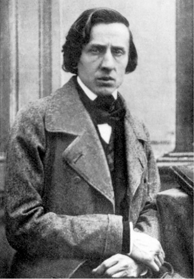
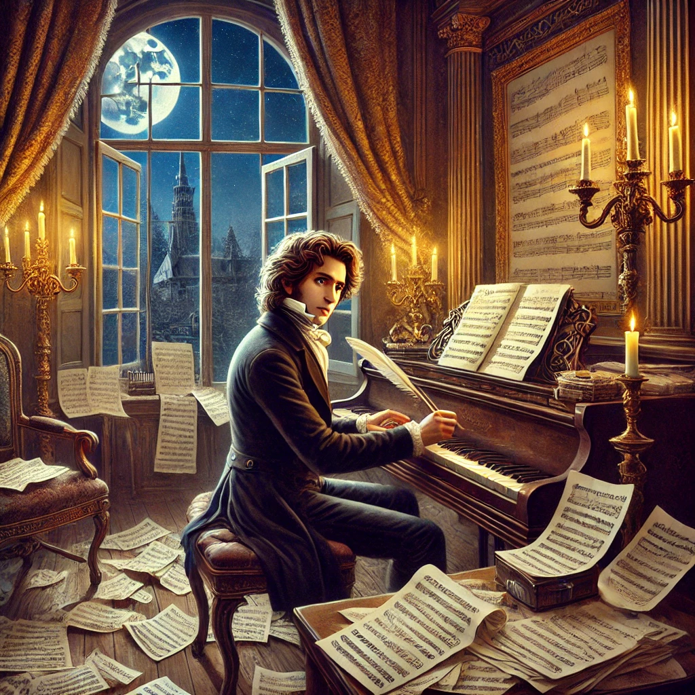
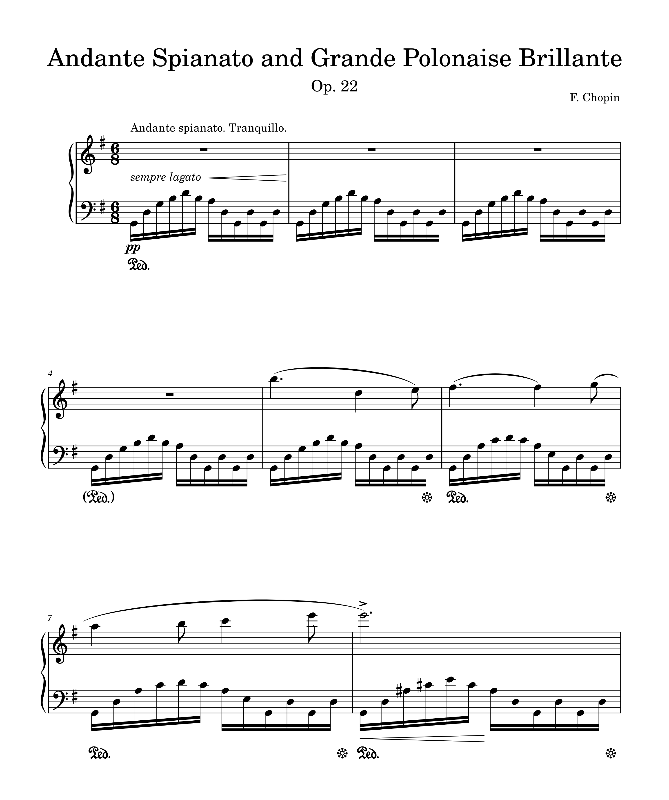

# Fryderyk Chopin

Frédéric Chopin (1810–1849) was a Polish composer and virtuoso pianist of the Romantic era, widely regarded as one of the greatest composers for the piano. He was born in Żelazowa Wola, near Warsaw, Poland, and showed prodigious musical talent from a young age.
## Musical Style
Chopin's works are characterized by their emotional depth, lyrical melodies, and innovative harmonies. He had a unique ability to blend technical brilliance with profound expressiveness.
He wrote almost exclusively for the piano, including nocturnes, waltzes, études, polonaises, and mazurkas.
## Significance of National Identity
Chopin’s Polish heritage played a vital role in his music. Many of his works, such as the polonaises and mazurkas, reflect Polish folk themes and dances.
Although he spent much of his life in France, he remained deeply connected to his homeland, especially during Poland’s struggles for independence.
## Life in France
Chopin moved to Paris in 1831, where he became a central figure in the city's vibrant cultural scene. He associated with artists like Franz Liszt and writers such as George Sand (his longtime romantic partner).
In Paris, he primarily performed in intimate salon settings rather than large concert halls.
## Health and Legacy
Chopin suffered from poor health throughout his life, likely due to tuberculosis, which led to his early death at the age of 39.
Despite his short life, Chopin left an indelible mark on music, influencing countless composers and earning a place as one of history's most beloved pianists and composers.

- [Timeline](#timeline)
- [Andante Spianato and Grande Polonaise Brillante in E flat major Op. 22](#andante-spianato-and-grande-polonaise-brillante-in-e-flat-major-op-22)
- [Overview of the Work](#overview-of-the-work)
- [1. Andante Spianato](#1-andante-spianato)
- [2. Grande Polonaise Brillante](#2-grande-polonaise-brillante)
- [3. Combination of the Two](#3-combination-of-the-two)
- [Background of the Work](#background-of-the-work)
- [Musical Features](musical-features)
- [Performance and Legacy](#performance-and-legacy)
- [Questions for Review](#questions-for-review)
- [Guides for Further Studies](#guides-for-further-studies)

## Timeline
|      Year     | Event              | Description                                                                                | Youtube                                                      |
|---------------|--------------------|--------------------------------------------------------------------------------------------|--------------------------------------------------------------|      
|    **1810**   | Birth              | Born on March 1, 1810 in Paris, France.                                                    |                                                              |
|    **1817**   | First Compositions | At just seven years old, Chopin composed two polonaises.                                   |                                                              |
|    **1826**   | Study              | Studies at the Warsaw Conservatory.                                                        |                                                              |
|    **1829**   | First success      | Chopin performed in Vienna, where his concerts were highly praised.                        |                                                              |
|    **1831**   | Settlement         | Chopin settled in Paris, where he became a successful pianist, composer, and piano teacher.|                                                              |
|    **1834**   | Composition        | Completed Andante Spianato and Grande Polonaise Brillante, Op. 22                          | [listen](https://youtu.be/AO6k_ipgEsI?si=4w1jvXnAqDdkY7mU)🎹 |   
| **1840-1846** | Golden Era         | Chopin enjoyed the height of his career in Paris.                                          |                                                              | 
|    **1849**   | Death              | Died in Paris, October 17, 1849.                                                           |                                                              |

## Andante Spianato and Grande Polonaise Brillante in E flat major Op. 22
The Andante Spianato and Grande Polonaise Brillante in E-flat major, Op. 22, is one of Frédéric Chopin's most celebrated works, blending poetic lyricism with dazzling virtuosity. It consists of two sections that were composed at different times and later combined by Chopin for performance.

### Overview of the Work
#### 1. Andante Spianato
- The term "spianato" means "smooth" or "even," reflecting the serene, flowing quality of this piece.
- It serves as a lyrical and introspective introduction to the more energetic Polonaise that follows.
- Written for solo piano, it features a tranquil, song-like melody supported by delicate arpeggios.
- The Andante Spianato exudes a dreamlike atmosphere, showcasing Chopin's ability to evoke deep emotions through simplicity.
#### 2. Grande Polonaise Brillante
- Composed earlier, in 1830-31, this section is a lively, exuberant dance in polonaise rhythm.
- It exemplifies Chopin's mastery of the polonaise, a traditional Polish dance form, infused with elegance and brilliance.
- The piece alternates between virtuosic passages and lyrical moments, demanding both technical skill and interpretative finesse from the pianist.
- It was originally written for piano and orchestra but is often performed as a solo piano transcription.
#### 3. Combination of the Two
- In 1834, Chopin combined the Andante Spianato with the Grande Polonaise Brillante, creating a single cohesive work.
- This combination begins with the reflective Andante Spianato and transitions seamlessly into the sparkling Polonaise.
  
### Background of the Work
Chopin composed this piece in the 1830s, completing the initial draft in 1834. After some revisions, the final version was published in 1836.
The piece reflects Chopin's nostalgia for Poland and his patriotic sentiments.
By combining virtuosic elements with poignant lyricism, it embodies Chopin's distinctive style.

### Musical Features
It showcases Chopin's signature singing melodies and ornate embellishments.
The Andante spianato is gentle and graceful, while the Grande Polonaise Brillante is majestic and dazzling, creating a striking contrast.
Chopin's reimagining of the traditional Polish polonaise in his unique style is particularly noteworthy.

### Performance and Legacy
- The work is a favorite in concert repertoire, showcasing the pianist’s lyrical expressiveness and technical prowess.
- Its dual character—peaceful introspection in the Andante and dazzling brilliance in the Polonaise—offers a vivid display of Chopin’s compositional range.
The Andante Spianato and Grande Polonaise Brillante remains a shining example of Chopin’s genius, blending the intimate and the grand in a way that continues to captivate audiences worldwide.

### Questions for Review
1. What is the historical and musical significance of Chopin's Grande Polonaise Brillante in the context of Romantic piano repertoire?
2. How does Op. 22 reflect Chopin’s Polish heritage and his connection to the polonaise as a dance form?
3. In what year was Chopin's Op. 22 composed, and how does it fit into his broader compositional timeline?
4. How is the work structured? What are the main sections of the Andante spianato et Grande Polonaise Brillante?
5. How does Chopin combine lyrical and virtuosic elements in this piece?
6. What is the role of the Andante spianato as an introduction to the Grande Polonaise Brillante? How does it set the mood for the work?
7. What compositional techniques does Chopin use to highlight the brilliance and grandeur of the Grande Polonaise?
8. How does the orchestral accompaniment interact with the piano in this piece?
9. In what ways does the work showcase Chopin’s innovations in pianistic texture and figuration?
10. What challenges does the piece pose for pianists, both technically and interpretatively?
11. How might a performer balance the contrasting characters of the Andante spianato and the Grande Polonaise Brillante?
12. How has this work been received by audiences and critics over time, and how might this influence its performance today?

### Guides for Further Studies
1. In-Depth Video Analysis:
Chopin's Op. 22 In-Depth: Andante spianato et Grande Polonaise Brillante: This video provides a comprehensive walkthrough of the piece, discussing its structure, themes, and performance aspects. [link](https://youtu.be/VayFGI-hnOE?si=ry6mA5rWz0oVyafE)
2. Sheet Music and Scores:
IMSLP - International Music Score Library Project: Provides free access to various editions of the score, including original manuscripts and critical editions. [link](https://imslp.org/wiki/Andante_spianato_et_Grande_polonaise_brillante%2C_Op.22_%28Chopin%2C_Fr%C3%A9d%C3%A9ric%29?utm_source=chatgpt.com)

