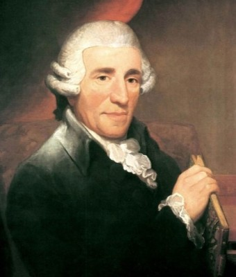
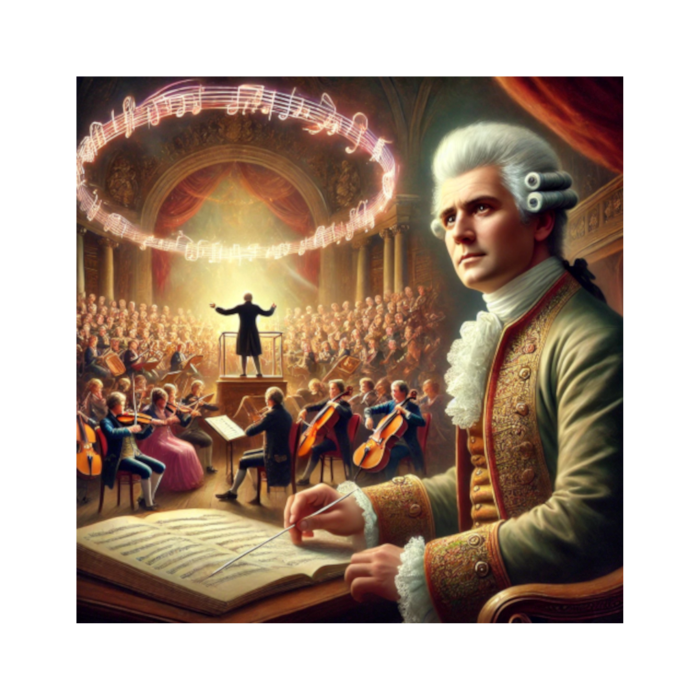

# Franz Joseph Haydn
## Piano Sonata Hob. XVI:50 1. Allegro

 

- [Haydn's life and career](#haydns-life-and-career)
- [Form: Sonata-Allegro Form](#form-sonata-allegro-form)
   -[Exposition](#exposition)
   -[Development](#development)
   -[Recapitulation](#recapitulation)
   -[Coda](#coda)
- [Tips for practicing](#tips-for-practicing)
- [Listening Guide](#listening-guide)
- [Questions-for Review](#questions-for-review)
- [Guide for further studies](#guide-for-further-studies)

---

## Haydn's life and career

| Year      | Event       | Description                                  | Youtube                                                   |
| ----      | ----        | ------------------------------------------   | --------------------------------------------------------- |
| 1732      | Birth       | Born on March 31, Rohrau, Austria            |                                                           |
| 1760      | Job         | Esterhazy Family                             |                                                           |
| 1772      | Early work  | Symphony No. 45 "Farewell"                   | [Watch](https://www.youtube.com/watch?v=tq1nc4Gyp0c) :tv: |
| 1794      | Finest work | Symphony No. 104 in D major "London"         | [Watch](https://www.youtube.com/watch?v=kg6Q9tkHOw0) :tv: |
| 1798,1801 | Oratorio    | "The Creation", "The Seasons"                | [Watch](https://www.youtube.com/watch?v=TPv1g9t_mKo) :tv: |
| 1809      | Death       | May 31, in Vienna during the Napoleonic Wars |                                                           |

Haydn is famous for his symphonies, enough to be called the "Father of the Symphony." However, we should know that he has left many achievements in other fields as well. He is famous for epitomizing classical instrumental music and especially for completing the sonata form in the first movement. 

The sonata form he completed can be seen as having a great influence on Beethoven's sonata later.
[Beethoven Piano Sonata](beethoven-sonata-26.md).

His piano sonatas, like his symphonies and string quartets, are celebrated for their creativity, charm, and technical skill. Haydn’s work often balances humor and wit with structural mastery, and his Piano Sonata Hob. XVI:50 in C Major is no exception. Composed in the later years of his life, this sonata reflects both Haydn's mastery of the Classical style and his ability to infuse his music with a distinctly joyful and playful character.
This sonata, written around 1794–1795, was created for Terezie Jansen, a talented pianist and student of Clementi. Jansen was known for her virtuosic playing, and this piece, with its lively energy and subtle complexity, was perfectly suited to her flamboyant style. The first movement, marked Allegro, showcases Haydn’s characteristic blend of simplicity and sophistication, with a focus on rhythm, melody, and dynamic contrast.

The reason why I chose this piece is that among the sonata's characteristics that require sophisticated expression of emotion and balance without being overly emotional, there are many couples who express optimistic and humorous characteristics of Haydn. Among the piano sonatas that can be a little serious, I thought it was the special charm of Haydn's sonata. In particular, there are many humorous and humorous expressions in the first movement of this song. I wanted to delve into the beauty of this song in detail, where there are many topics and conversations of responses. 

The first movement, marked "Allegro," opens with a bright and assertive theme that immediately captures the listener's interest. This movement is characterized by its lively rhythmic drive and clear structural form. The main theme is introduced with a bold, upward leap, setting a cheerful and energetic tone. Haydn’s use of syncopation and rapid passages adds a sense of excitement, inviting the pianist to showcase both technical prowess and expressive nuance. As the movement progresses, Haydn masterfully develops the initial themes, weaving in contrasting material that highlights his wit and creativity. The secondary theme offers a delightful contrast, featuring a more lyrical quality that creates a charming dialogue within the piece. Haydn's knack for surprising harmonic shifts keeps the listener engaged, as he deftly explores the interplay between major and minor tonalities. The development section introduces moments of tension, showcasing Haydn's ability to build suspense before returning to the joyous energy of the opening themes. The movement concludes with a spirited recapitulation, bringing back the initial themes with renewed vigor and culminating in a jubilant finale. In this sonata, Haydn not only captures the essence of the Classical style but also hints at the emotional depth that will define the Romantic era to come.

---

## Form: Sonata-Allegro Form
Like many Classical sonatas, the first movement follows the traditional sonata-allegro form, consisting of three main sections: the Exposition, the Development, and the Recapitulation, followed by a Coda.

### Exposition
The movement opens with the first theme in C major, a lively and assertive motif. After presenting this theme, Haydn transitions to the dominant key of G major, where a secondary theme emerges, offering a lyrical contrast to the opening. [You can mention that unlike Haydn's other sonatas, this one is unusual because he created a long transition (about 18 bars) after the first theme before moving on to the second theme}
### Development
In the development section, Haydn takes the initial themes through various key changes, manipulating and transforming them in playful and dramatic ways. The tension created here adds interest and anticipation before the music returns to the home key.
### Recapitulation
The recapitulation brings back the main theme, now firmly rooted in the home key of C major. This section often mirrors the exposition but may include slight variations or embellishments.
### Coda 
The movement concludes with a spirited coda, reintroducing elements from earlier in the movement and culminating in a jubilant finish.

---

### Musical Characteristics
Rhythm and Articulation: The first movement features lively rhythms and clear articulation, allowing for expressive playing. The use of staccato and legato contrasts adds to the playful character.
Harmonic Language: Haydn's harmonic language is inventive, with unexpected modulations that keep the listener engaged.

### Performance Notes
Expression: Performers are encouraged to emphasize the contrasts between the themes and to bring out the playful elements. Dynamic variations and phrasing will enhance the movement's character.
The first movement of Haydn's Piano Sonata in C Major is a vibrant and engaging work that showcases Haydn's mastery of form and melody, making it a delightful experience for both performers and audiences.

### Emotional Connection
While the movement is upbeat and cheerful, it also contains moments of subtle expressiveness. The humor in the piece is not overt but comes through in Haydn's playful use of harmonic shifts and rhythmic surprises. Encourage performers to approach the piece with a sense of lightheartedness, allowing the music to flow naturally with a sense of optimism and joy.

---

## Tips for Practicing 

### Slow Practice
Begin by practicing slowly to ensure that each note is clear and that phrasing and dynamics are well defined. This will help in bringing out the charm of the piece and its contrasting sections.

### Hands Separately
Practice the right and left hands separately to gain confidence in the complex rhythmic and harmonic patterns before putting them together.

### Think of a Dialogue
Imagine the right hand as telling a story, with the left hand responding. This will help bring out the conversational nature of the music and the interaction between the two themes.

### Have Fun!
Above all, enjoy the music! Haydn’s Piano Sonata Hob. XVI:50 is a delightful work full of energy and wit, and it offers a rewarding experience both for the performer and the audience.

Overall, this first movement of Haydn’s Piano Sonata in C Major is a perfect example of his mastery of form, rhythm, and melody. It embodies the Classical spirit with a touch of humor and inventiveness, making it an enjoyable piece for performers and audiences alike.

---

## Listening Guide
This listening guide explores, offering insights into the unique interpretations of various pianists.

[1. Emanuel Ax's performance](https://www.youtube.com/watch?v=VijCE-3YvL8)
His performance is marked by its lively and playful energy. He focuses on the clarity of the passagework, allowing each note to resonate with precision. His touch is light, and the phrasing is natural, emphasizing the whimsical, almost conversational qualities of the music.

[2. Andres Schiff](https://www.youtube.com/watch?v=j344jYmqtDw)
The opening Allegro is light and brisk, with Schiff's attention to detail creating a sense of playful forward motion. Schiff emphasizes Haydn's wit and the sonata's rich emotional contrasts. His approach balances playful lightness with more introspective momnets.

[3. Glenn Gould](https://www.youtube.com/watch?v=VfmmVQhg3-0)
Gould plays with clear, almost detached articulation that emphasizes clarity over conventional lyricism. While this style may not bring the full "playfulness" some other performances capture, Gould’s rendition has a unique, crisp quality that highlights the structure of the piece in a way that reveals deeper layers of Haydn's compositional ingenuity. He occasionally emphasizes certain harmonic shifts and key moments with a slight push, providing both a sense of forward motion and a subtle invitation for reflection.

---

## Questions-for Review
- How does Haydn incorporate elements of surprise and humor into the sonata, particularly in the finale?

  Haydn frequent use of unexpected harmonic shifts and contrasting dynamics creates a sense of playfulness and unpredictability, a hallmark of Haydn’s wit. These moments of surprise keep the listener engaged and add a lighthearted, humorous character to the movement.

-  How would you describe the sonata’s character and emotional range?

    It opens with a vigorous and joyful theme in C Major, full of rhythmic drive and forward momentum, evoking a sense of optimism and excitement. The movement also introduces contrast through a second theme in G Major, which is more lyrical and expressive, offering a moment of calm reflection before returning to the lively, playful nature of the opening. Overall, the emotional range is uplifting and balanced, with Haydn's characteristic wit and lightness evident throughout the movement.

## Guide for further studies
Compare with sonatas by Haydn and Beethoven for stylistic differences. 
[Compare with sonatas](https://data.carnegiehall.org/datalab/experiments/chdl-0003/)

This platform offers discussions, performance advice, and sheet music, helping pianists understand the challenges and nuances of the sonata​
[Sheet music and discussions](https://www.pianostreet.com/haydn-sheet-music/sonatas/sonata-hob-16-50-c-major.htm)

 A detailed breakdown of the sonata's whole movements, harmonic structures, and thematic development, which will deepen your understanding of Haydn's compositional techniques
[Analysis](https://tonic-chord.com/haydn-piano-sonata-in-c-major-hob-xvi50-analysis/)
