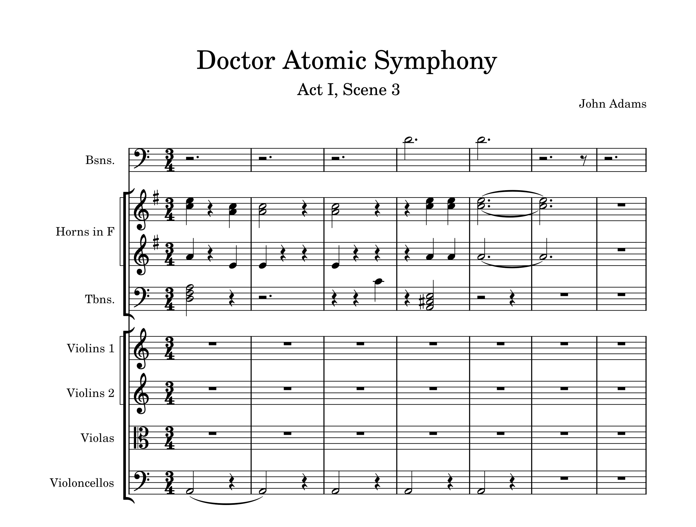

# John Adams

- [John Adams life and career](#john-adams-life-and-career)
  - [Compositional style](#compositional-style)
- [John Adams Opera](#john-adams-opera)
  - [Opera Doctor Atomic](#opera-doctor-atomic)
  - [Act I, Scene 3 "Batter my heart"](#act-i-scene-3-batter-my-heart)
  - [Listening Guide](#listening-guide)
- [Questions for Review](#questions-for-review)
- [Guide for Further Studies](#guide-for-further-studies)
  
---

## John Adams life and career

| Year      | Event                    | Description                                  | Youtube                                                   |
| --------- | ------------------------ | -------------------------------------------- | --------------------------------------------------------- |
| 1947      | Birth                    | Born on February 15, Massachusetts, USA      |                                                           |
| 1971      | Education                | Harvard University                           |                                                           |
| 1987      | First successful opera   | "Nixon in China"                             | [Watch](https://www.youtube.com/watch?v=0mtMI_huRtY) :tv: |
| 2003      | Awards                   | Pulitzer Preze for Music                     |                                                           |       
| 2005      | Most ambitious opera     | "Doctor Atomic"                              | [Watch](https://www.youtube.com/watch?v=AlUHKHLk_VU) :tv: |
| 2009~     | Career                   | Creative Chair of the L.A Philharmonic       |                                                           |

---

## Compositional style
John Adams' compositional style blends the repetitive structures and rhythmic patterns of minimalism with rich orchestration and emotional depth, creating a unique sound that evolves over time. 
He often incorporates complex harmonic textures and subtle shifts in rhythm, adding layers of intensity and drama. His works frequently explore political, historical, and moral themes, with a particular focus on contemporary issues, blending intellectual exploration with powerful emotional expression. Adams' music is known for its dramatic narrative quality, especially in his operas, where he combines modern musical language with compelling storytelling.

John Adams’ Dr. Atomic explores the moral and existential dilemmas surrounding the creation of the atomic bomb, much like Beethoven’s works reflect profound moments of human struggle and innovation. Both composers confront pivotal moments in history—Beethoven through the revolutionary spirit of his symphonies and Adams through the ethical consequences of scientific advancement. While Beethoven broke musical boundaries in his time, Adams similarly pushes the boundaries of opera by combining minimalism and modernism to address complex themes. Ultimately, both composers use their music to explore the tension between human ambition and its often catastrophic consequences.
-[Beethoven symphony](beethoven-symphony-no-9.md)

---

## John Adams' Opera
John Adams' operas are known for their innovative use of modern musical techniques, blending minimalist influences with rich orchestration and complex rhythms. His works often tackle significant historical and political events, such as Nixon in China, which explores Nixon's 1972 visit to China, and Doctor Atomic, which delves into the moral and emotional struggles of those involved in the development of the atomic bomb. Adams' operas are characterized by compelling narratives, complex characters, and a deep exploration of contemporary issues, combining intellectual depth with dramatic intensity. His music engages with themes of morality, responsibility, and the human impact of technological advancements, making his operas both thought-provoking and emotionally powerful.

---

## Opera Doctor Atomic

 

### Plot and themes
Doctor Atomic dramatizes the intense and morally fraught moments leading up to the first test of the atomic bomb in July 1945. The opera is set in Los Alamos, New Mexico, and centers on the scientists, military personnel, and their psychological struggles as they prepare for the Trinity test.

### Main Characters
-J. Robert Oppenheimer: The central figure, portrayed as a conflicted and complex individual torn between scientific achievement and ethical responsibility.
-Edward Teller: Another prominent physicist with differing views on the bomb's purpose.
-General Leslie Groves: The military leader overseeing the Manhattan Project.
-Kitty Oppenheimer: Oppenheimer’s wife, adding a personal dimension to his moral struggle.

### Key Themes
Moral Ambiguity of Science: The opera explores the dual-edged nature of scientific discovery and its potential for destruction.
Human Struggle and Responsibility: It delves into the emotional toll on the individuals involved in the Manhattan Project.
Existential Fear: The imminent possibility of annihilation looms over the narrative.

### Music and Libretto
Innovative Musical Style: Adams' score blends minimalist techniques, expressive lyricism, and dramatic tension.
Use of repetitive patterns to heighten the psychological intensity.
Lush orchestral textures to convey the grandeur and terror of the atomic age.
Libretto: Peter Sellars constructed the libretto using a mix of historical documents, poetry, and personal letters.
Includes excerpts from John Donne and the Bhagavad Gita, enriching the opera’s philosophical and poetic dimensions.
Example: Oppenheimer's famous aria, "Batter my heart, three-person'd God," is adapted from Donne’s sonnet and encapsulates his internal turmoil.

### Critical Reception and Impact
Praised for its innovative storytelling and Adams' ability to humanize historical figures.
Some critics note its focus on character and mood over linear narrative as both a strength and a challenge.
Continues to be relevant as it reflects on the ethical dilemmas of technology and warfare in modern times.

## Act I, Scene 3 "Batter my heart"
 
"Batter my heart" is a poignant aria from John Adams' opera Doctor Atomic, performed by the character of J. Robert Oppenheimer. The text is adapted from a metaphysical sonnet by John Donne, which portrays a deeply personal plea to God for spiritual renewal through forceful intervention.
In the opera, the aria occurs at a climactic moment, reflecting Oppenheimer's internal conflict as he grapples with the moral implications of his role in creating the atomic bomb. The aria’s intense, introspective nature mirrors his anguish and sense of responsibility for unleashing a power capable of unprecedented destruction.

---

### Listening Guide
 [Opera Nixon in China"I am the wife of Mao Tse-tung"](https://www.youtube.com/watch?v=0mtMI_huRtY)
 
 [Opera "Doctor Atomic" Full version](https://www.youtube.com/watch?v=PKvKHl9qskk&pp=ygUTZG9jdG9yIGF0b21pYyBvcGVyYQ%3D%3D)
 
 [Doctor Atomic-Act I, Scene 3 "Batter my heart"](https://www.youtube.com/watch?v=AlUHKHLk_VU)

---

## Questions-for Review
- Do you think operas like John Adams’s are more effective at addressing contemporary issues than traditional operas?

  Operas like those by John Adams are often more effective at addressing contemporary issues than traditional operas due to their direct engagement with modern political, ethical, and scientific themes. For instance, Doctor Atomic confronts the moral dilemmas surrounding the atomic bomb, while Nixon in China deals with the complex geopolitical tensions of the late 20th century. These works use minimalist techniques and contemporary settings to make their themes more immediate and relatable to modern audiences, compared to the often historical or mythological subjects of traditional operas. Adams's operas engage with the world in real-time, allowing them to reflect current issues more dynamically.

- Why is John Adams considered a significant composer in modern opera?

  John Adams is considered a significant composer in modern opera due to his innovative use of minimalist techniques combined with emotional and dramatic complexity. His operas, like Nixon in China and Doctor Atomic, tackle contemporary political, historical, and ethical issues, making them deeply relevant to modern audiences. His unique approach blends accessible, repetitive structures with lush orchestration, making complex subjects emotionally engaging.
  
- How does Adams use minimalist techniques in his operas? What effect do these techniques have on the audience?

  By employing repetitive rhythmic patterns, shifting harmonic structures, and gradual evolution of musical material. These techniques create a sense of hypnotic momentum and intensity, enhancing the dramatic tension. In Doctor Atomic, for example, the music reflects the escalating urgency of the Manhattan Project through persistent, evolving motifs.
  
## Guide for further studies
[Educational resources](https://www.pbslearningmedia.org/resource/doctor-atomic-opera/doctor-atomic-opera/)

[About Opera](https://openlyopera.wordpress.com/)
