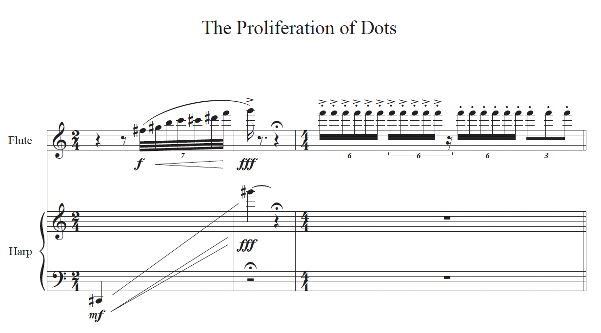

# Moonhee Lee
## The Proliferation of Dots's Explanation

"The Proliferation of Dots” composed in 2024 by Moonhee Lee, was inspired by Wassily Kandinsky’s book Point and Line to Plane, which explores the Russian painter and art theorist’s ideas on art and abstraction.

---

- [Timeline](#timeline)
- [Who is Moonhee Lee?](#who-is-moonhee-lee)
- [Instrumentation](#instrumentation)
- [What is this piece?](#what-is-this-piece)

---

## Timeline

| Year | Event      | Description                                                                | Youtube                                                  |
| ---- | ---------- | -------------------------------------------------------------------------- | ---------------------------------------------------------|
| 1988 | Birth      | Born on September 13, 1988 in Busan, Republic of korea                     | [Watch](http://moonheelee.com/) 🌐                       |      
| 2012 | Early Work | Eolssigu Eolssu for percussion and esemble (Clarinet, Piano, Volin, Cello) | [Listen](https://www.youtube.com/watch?v=cSqhM9DPHr4) 📺 |
| 2024 | This Work  | The Proliferation of Dots for orchestra                                    | Not yet 😢                                               |

* Since the piece was performed recently, I will update it once a link is uploaded to YouTube.
   
## Who is Moonhee Lee?

Moonhee Lee was born in Busan(South Korea), in 1984 and studied composition with Jongwoo Yim and Doneung Lee at Hanyang University in Seoul. He received a Master’s degree from Luebeck National University of Music, studying with Dieter Mack and received his professional studies from the University of Music and Peforming Arts Munich in Germany under the guidance of Isabel Mundry.

His works for orchestra as well as his chamber music pieces received various national and international prizes such as the grand prize at the 39th Korean National Composer Prize, the first prize in international Younghi Pagh-Pann Composition Prize 2019, the second Prize from the Hongkong International Competition for Percussion Composition, Honorary Mention in composition competition ‘Franz Schubert and Modern Music’. Furthermore, he was also chosen for 'Composer of Paan-Tree of Life in 2018'.

Moonhee Lee is currently professor at Hanyang University

---

---

## Instrumentation

* 2 flutes (2nd doubling Piccolo)
* 1 oboe
* 1 English horn
* 2 clarinet in Bb (2nd doubling bass clarinet in Bb)
* 1 bassoon
* 1 contrabasson

* 2 horns in F (use straight mute)
* 2 trumpets in C (use wa-wa, cup, practice mute)
* 2 trombones (uses plunger, cup mute)
* 1 bass trombone (use straight mute)
* 1 tuba (use straight mute)

* timpani (tam-tam, cymbal with bow)

* 2 percussions
* I. vibraphone, glockenspiel, supended cymbal, mark tree
* II. marimba, tubular  bell, bass drum

* harp

* violins I
* violins II
* violas
* violoncellos
* contrabasses (including 5th string)

---

## What is this piece?
> It is the first premiere of composer Moonhee Lee’s work in 2024. This piece is the result of his first compositional exploration inspired by reading Point and Line to Plane, a book written by Wassily Kandinsky (1866–1944), a Russian-born painter and art theorist. After reading the book, I moved beyond the simple approach I had previously taken—that a point connects to form a line, and lines combine to form a plane. Instead, I began considering the formal qualities and inherent characteristics of points, lines, and planes, which led me to compose a series of independent pieces based on these elements. In Point and Line to Plane, I was particularly intrigued by Kandinsky’s explanation of the “reproductive power” of points. Just as seeds and cells in nature inherently hold potential for reproduction, points, as their numbers increase, provide a foundation for more diverse forms to emerge. Linguistically, points connect sentences, playing a crucial role in the development of a narrative. In visual art, points are created by tools striking a surface, and the continuation of these strikes gives rise to shapes. Drawing from this perspective, I conceptualized the proliferation of points in this piece as the emergence of specific sounds and their residual musical traces.

> The piece begins with indistinct resonances from percussion instruments like tam-tams and mark trees, alongside the orchestral sonorities of lingering reverberations. Gradually, point-like sounds emerge in various registers, accumulating and overlapping with tonal echoes. A central tone grows into a cluster of surrounding tones, while the vertically layered accents of multiple instruments expand amidst irregular rhythms. Particularly, pizzicatos and other brief accent flashes develop into rhythmic proliferations of shorter sounds, further extending into sonorous tremolos, trills, and eventually evolving into polyrhythms across various instruments.

---

## Questions for Review

Q1. Which Russian-born painter inspired the theme of this piece?

Q2. Which percussion instruments were used to create indistinct sounds at the beginning of this piece?

---

## Guides for Further Studies

Professor Lee is currently teaching 20th Century Music 4 at Hanyang University. If you’re curious about one of the key figures discussed in this course, Arnold Schoenberg, you can refer to this [link](schonberg-pierro-lunaire.md)
