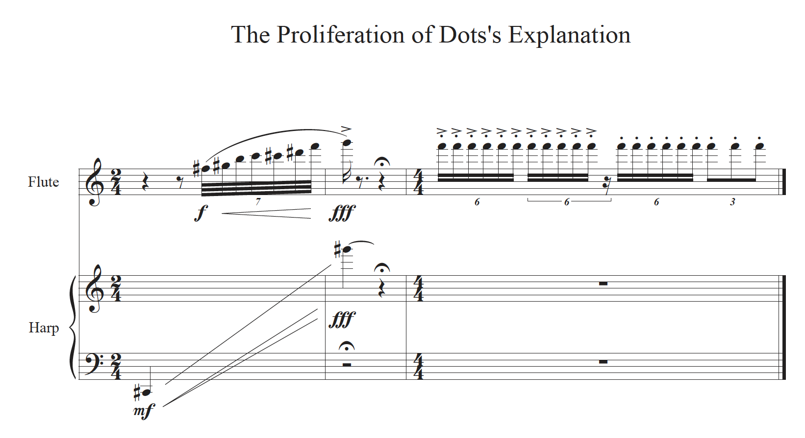

# Moonhee Lee
## The Proliferation of Dots's Explanation

1. Composer : Moonhee Lee
2. Title : The Proliferation of Dots
3. Year of Composition : 2024
4. Structure : This piece was composed after reading point and line to pane, a book by Wassily Kandinsky, a Russian painter and art theorist.

---

- [Timeline](#timeline)
- [Who is Moonhee Lee?](#who-is-moonhee-lee)
- [Instrumentation](#instrumentation)
- [Importance](#importance)

---

## Timeline

| Year | Event      | Description                                                                | Youtube                                                  |
| ---- | ---------- | -------------------------------------------------------------------------- | ---------------------------------------------------------|
| 1988 | Birth      | Born on September 13, 1988 in Busan, Republic of korea                     | [Watch](http://moonheelee.com/) 🌐                       |      
| 2012 | Early Work | Eolssigu Eolssu for percussion and esemble (Clarinet, Piano, Volin, Cello) | [Listen](https://www.youtube.com/watch?v=cSqhM9DPHr4) 📺 |
| 2024 | This Work  | The Proliferation of Dots for orchestra                                    | Not yet 😢                                               |

## Who is Moonhee Lee?

Moonhee Lee was born in Busan(South Korea), in 1984 and studied composition with Jongwoo Yim and Doneung Lee at Hanyang University in Seoul. He received a Master’s degree from Luebeck National University of Music, studying with Dieter Mack and received his professional studies from the University of Music and Peforming Arts Munich in Germany under the guidance of Isabel Mundry.

His works for orchestra as well as his chamber music pieces received various national and international prizes such as the grand prize at the 39th Korean National Composer Prize, the first prize in international Younghi Pagh-Pann Composition Prize 2019, the second Prize from the Hongkong International Competition for Percussion Composition, Honorary Mention in composition competition ‘Franz Schubert and Modern Music’. Furthermore, he was also chosen for 'Composer of Paan-Tree of Life in 2018'.

Moonhee Lee is currently professor at Hanyang University

---

---

## Instrumentation
> This work made for full orchestra.

---

## Importance
> It is the first premiere of composer Moonhee Lee’s work in 2024.

---

## Questions for Review

---

## Guides for Further Studies

