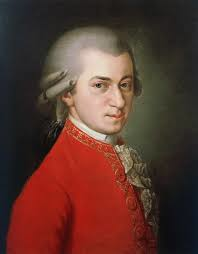

# A. Mozart
# Symphony No. 41 "Jupiter"

## Wolfgang Amadeus Mozart (1756–1791)
Wolfgang Amadeus Mozart is one of the most important and influential composers in Western classical music history. 
His significance extends across various aspects of music, including innovation, technical mastery, emotional depth, and his lasting influence on future composers and musical traditions. 
Mozart opened new paths in various genres, including symphonies, concertos, operas, religious music, and chamber music. In particular, in opera, he brilliantly expressed psychological depth and human nature, setting a new standard for opera composition. Representative works include The Marriage of Figaro, Don Giovanni, and The Magic Flute.

## Mozart's Symphony No. 41 in C major, K. 551
Mozart's Symphony No. 41 in C major, K. 551, commonly known as the Jupiter Symphony, was his last symphony and was composed in 1788. 
The Jupiter Symphony raised classical formal beauty and balance to the highest level. Each movement is elaborately composed, and the melody and harmony are perfectly harmonized, making it an ideal model of a classical symphony. In particular, the fugue finale of the last movement is considered the pinnacle of classical symphonic composition.
Moreover, it goes beyond simple formal completion and expresses the multi-layered aspects of human emotions. From the energetic theme of the first movement to the lyrical and emotional melody of the second movement, the classical elegance of the third movement, and the majesty and grandeur of the fourth movement, it captures a wide range of emotions and leaves a strong impression on the listener.
This symphony later had a profound influence on Beethoven, Schubert, and others, serving as an important guide to composing symphonies during the Romantic era. In particular, Beethoven inherited the contrapuntal elements and structural grandeur of the Jupiter Symphony and reflected them in his own works.
 

## *Description of each movement*
#### Movement I: Allegro vivace
The first movement opens with a spirited and bold C major theme. This theme is built around a short, rhythmically strong motif, showcasing the grandeur associated with the "Jupiter" title. Mozart employs a sonata-allegro form, contrasting the bold, rhythmic main theme with a lyrical second theme in the dominant key of G major. This duality between energy and grace persists through the development, where Mozart explores various key areas, transforming the opening motifs before a recapitulation and coda reinforce the main theme.

#### Movement II: Andante cantabile
The second movement, in the subdominant key of F major, serves as a lyrical contrast to the assertiveness of the first movement. This Andante cantabile presents a stately and song-like main theme that unfolds through a series of variations and chromatic modulations, adding depth and poignancy. The movement’s rounded binary structure (ABAB) and its harmonic richness provide a contemplative counterpoint to the surrounding movements, creating an expressive depth that is both tender and harmonically sophisticated.

#### Movement III: Menuetto: Allegretto
The third movement is a minuet and trio, providing a light-hearted yet ceremonious contrast to the previous movements. In C major, the minuet section features balanced phrasing with clear harmonic shifts, lending it a sense of Classical refinement. The trio, in the contrasting key of A minor, introduces a darker, more introspective quality before the return of the minuet. This movement follows the standard ternary form (minuet–trio–minuet), allowing Mozart to create contrast within a highly symmetrical framework.

#### Movement IV: Molto allegro
The final movement is notable for its intricate counterpoint, showcasing Mozart’s skill with polyphonic writing. Here, he presents five thematic subjects that are developed both independently and in combination, culminating in a climactic fugato. The movement follows a sonata-allegro form with fugal elements, which Mozart incorporates into the development section and in the closing fugue. This complex counterpoint adds a sense of structural grandeur and inevitability, reinforcing the "Jupiter" character of the symphony. The movement concludes with a powerful coda that reaffirms the work’s majestic C major tonality.

## Form and Style
Symphony No. 41 exemplifies the Classical symphony through its four-movement structure, clear harmonic language, and melodic clarity. Mozart’s use of contrasting themes within sonata and ternary forms, as well as his integration of counterpoint in the final movement, reflects the evolution of the Classical style toward a balance of homophonic and polyphonic textures. In particular, the contrapuntal complexity in the finale anticipates the symphonic style of the 19th century, marking the work as a transition between the Classical and Romantic symphonic forms.

## Historical Significance
The Jupiter Symphony stands as one of Mozart’s crowning achievements, representing the height of his symphonic output and a culmination of the Classical symphonic tradition. Its balance of formal clarity, thematic development, and polyphonic richness has made it a benchmark for symphonic writing, influencing composers from Beethoven to Brahms. The symphony’s timeless appeal lies in its combination of structural complexity and expressive immediacy, qualities that continue to engage audiences and performers alike.

wow~ what a nice text.

Comment: I wish Mozart's picture was a little bigger. But the content is good!

***I think the 'a.mozart' on the top line can be removed. The full name written below seems better.***
