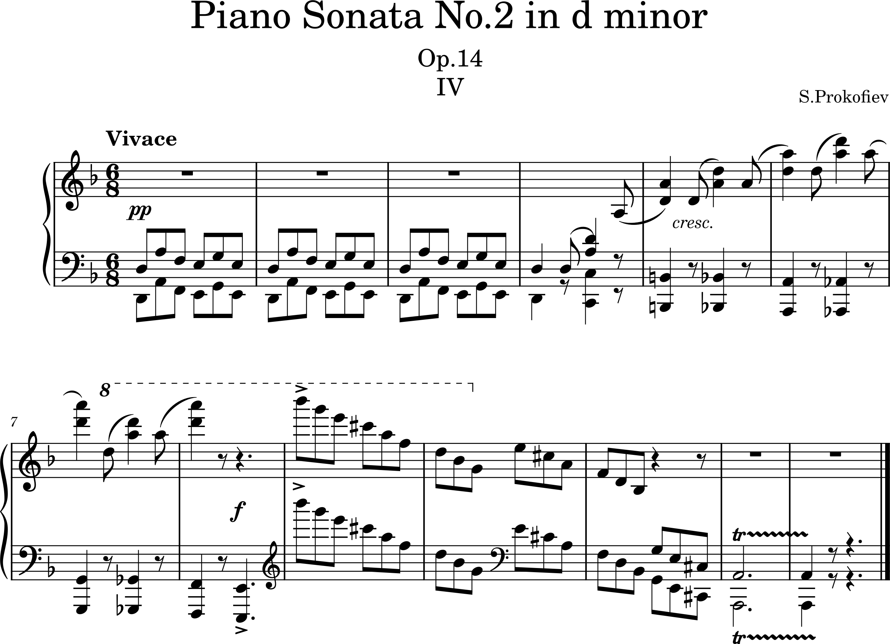

# Sergei Prokofiev (1891-1953)
## Piano Sonata No.2 in d minor, Op.14

**Sergei Prokofiev (1891-1953)** was a prominent 20th-century Russian composer known for his unique blend of classical forms and modern sensibilities. He excelled in various genres, including symphonies, ballets, operas, and piano works, leaving behind masterpieces such as *The Classical Symphony*, *Romeo and Juliet*, and *Peter and the Wolf*. Renowned for his innovative and experimental style, Prokofiev had a profound influence on both Russian and global music, with his works characterized by powerful rhythms, distinctive harmonies, and evocative melodies.

**Prokofiev’s Piano Sonata No. 2, Op. 14** is a work in which he transforms classical form with a modern sensibility, showcasing both musical depth and technical challenges. The sonata reflects the innovative characteristics of early 20th-century music and presents an opportunity for performers to express a wide range of emotions, making it an engaging and meaningful challenge. Moreover, this piece demonstrates the development of Prokofiev's musical language and his pursuit of innovation within the music scene of his time. 
Also, this sonata was one of my performance pieces. Originally, I didn't particularly enjoy this genre. However, while studying Sonata No. 2, I feel that my musical perspective has broadened.

---

- [Timeline](#timeline)
- [Overview](#overview )
- [Structure](#structure)
 -[I. Allegro, ma non troppo](#i-allegro-ma-non-troppo)
 -[II. Scherzo: Allegro marcato](#ii-scherzo-allegro-marcato)
 -[III. Andante](#iii-andante)
 -[IV. Vivace](#iv-vivace)
- [Musical Significance](#musical-significance)
- [Conclusion](#conclusion)

---

# Timeline 

| Year      | Event                                   | Description                                                                    | Youtube |
| --------- | --------------------------------------- | ------------------------------------------------------------------------------ | ------- |
| 1891      | Birth                                   | Born in Sontsovka, Ukraine.                                                    |
| 1904      | First Composition                       | Begins studying music at the Saint Petersburg Conservatory.                                     |
| 1914      | Graduation and Early Works              | Graduates and starts composing seriously.                                      |              |
| 1917      | Russian Revolution and Move to the West | Moves to the West due to the Russian Revolution, living in Europe and the U.S. | 
| 1923      | Paris and Early Success                 | Establishes himself in Paris, composing works like The Love for Three Oranges. | [Listen](https://www.youtube.com/watch?v=7Q0toEhKRWk) :tv: |
| 1936      | Return to the Soviet Union              | Returns to the Soviet Union, facing political restrictions.                    |
| 1938-1941 | World War II and Increased Recognition  | Composes major works like War Sonatas, Cinderella, and Alexander Nevsky.       | [Listen](https://www.youtube.com/watch?v=h21KSLqj7HA) :tv: |
| 1948      | Official Denouncement                   | Officially denounced by Soviet authorities for "formalism".                    |                                                  |
| 1953      | Death                                   | Dies on March 5, the same day as Stalin, overshadowing his death.              |
                                           

---

---
# Overview

**Prokofiev's Piano Sonata No. 2 in D Minor, Op. 14** composed in 1912, is a work lasting approximately 20 minutes. It consists of four movements, each characterized by contrasts between lyrical elements and energetic rhythms. The first movement, **"Allegro, ma non troppo,"** features lively and bold rhythms, while the second movement, **"Scherzo: Allegro marcato,"** emphasizes sharp, accented rhythms, creating a humorous and witty atmosphere. The third movement, **"Andante,"** is lyrical and introspective, and the fourth movement, **"Vivace,"** concludes the work with fast, energetic passages.

This sonata represents Prokofiev's reconstruction of classical forms with modern harmonies and rhythms, reflecting the avant-garde musical trends of the time. It is also a highly virtuosic work, requiring the performer to demonstrate technical prowess with its complex rhythms and fast tempos. **Piano Sonata No. 2 Op. 14** is an important piece that showcases Prokofiev's experience with early 20th-century musical innovations and subtle influences from Russian folk music.

---

# Structure

The Sonata is in four movements:

1. **Allegro ma non troppo**
2. **Allegro marcato**
3. **Andante**
4. **Vivace**

---

### I. Allegro, ma non troppo
The first movement begins with a dynamic energy, adhering to the classical sonata form but infused with Prokofiev's modern harmonic and rhythmic language. It opens with rapid tempos and vigorous rhythms, creating a sense of tension and instability through contrasting themes. The main theme is clear and forceful, but it is repeatedly transformed, showcasing Prokofiev’s use of rhythmic repetition and harmonic shifts. The movement builds on a constant sense of forward momentum, yet it ends with a sense of resolution, bringing some stability to the initially unsettled atmosphere.

### II. Scherzo: Allegro marcato
The second movement is a scherzo, marked by playful and sharp rhythms. This lively and energetic movement is full of humor and technical complexity, characteristic of Prokofiev's music. The "Allegro marcato" directive suggests not just a fast tempo, but an emphasis on strong rhythmic accents, creating a sense of rhythmic punch and sudden contrasts. The scherzo features repeated rhythmic patterns, abrupt changes, and virtuosic passages that challenge the performer. Its lively, mischievous character contrasts with the more dramatic energy of the other movements, and the movement’s unpredictable nature gives it a sense of whimsical playfulness.

### III. Andante
The third movement brings a striking shift in mood, offering a lyrical and introspective contrast to the earlier movements. Marked "Andante," this slow movement is deeply expressive, with delicate melodies and smooth harmonies that evoke a sense of serenity and reflection. Prokofiev steps away from technical virtuosity here, focusing instead on emotional expression. The movement has a tranquil and meditative quality, with a sense of continuity in the melodic lines, creating a sustained emotional depth. This section offers a respite from the previous dynamic energy, immersing the listener in a more contemplative and emotional sound world.

### IV. Vivace
The final movement is a vigorous and high-energy conclusion to the sonata. Marked "Vivace," this movement is characterized by rapid tempos and intense rhythmic drive. Complex and intertwining musical figures create a sense of relentless forward motion, with Prokofiev’s use of fast, intricate patterns providing a challenge to the performer. The movement brings the sonata to an explosive climax, resolving the tensions built in the previous movements. Its dramatic and virtuosic nature wraps up the work with an exhilarating sense of closure, leaving the listener with an overwhelming impression of energy and finality.

---

# Musical Significance 

Sergei Prokofiev’s **Piano Sonata No. 2**, Op. 14, follows a classical sonata form while introducing innovative modern harmonies and rhythms, pushing the boundaries of traditional music. This piece reflects the experimental and progressive trends of early 20th-century music. Each movement has its own distinct emotional character: the first movement conveys intense energy and tension, the second brings humor and lightness, the third is lyrical and emotional, and the final movement concludes with a lively and energetic finale, resolving all the emotional tensions.

The sonata demands high technical skill from the performer, but this virtuosity is used not for display but as a means to enhance musical expression. Fast, complex rhythms, irregular time signatures, and unstable harmonies require a deep understanding and nuanced interpretation to convey the emotional subtleties of the music. Prokofiev uses this work to explore new possibilities in harmony and rhythm, marking a departure from the conventions of his time and showcasing his musical innovation.

**Piano Sonata No. 2** is not just a technical challenge but a landmark in early 20th-century music, demonstrating how Prokofiev expanded his musical language. The work respects the traditions of classical music while presenting new possibilities, making it a significant milestone in the development of modern music.

---

# Conclusion

 **Prokofiev’s Piano Sonata No. 2, Op. 14** is a significant work that demonstrates early 20th-century musical innovation. The piece reinterprets the traditional classical sonata form with a modern sensibility, exploring new harmonic, rhythmic, and emotional depths. Each movement possesses a unique emotional character, and the technical challenges serve to enhance musical expression rather than merely displaying virtuosity. This sonata is not just a technical achievement but also a key milestone in the expansion of Prokofiev’s musical language, offering innovative ideas that contributed significantly to the development of 20th-century music.

---
## Influences

**Prokofiev's Sonata No. 2** is an important work that establishes his early compositional style and reflects various musical influences. The piece incorporates elements of Russian folk music, reinterpreting its rhythms and melodies in a modern way, thus offering a fresh take on the musical traditions of his homeland. Additionally, Prokofiev was influenced by late Romanticism, using emotional and dramatic melodies that show the impact of composers like Tchaikovsky and Rachmaninoff. However, at the same time, he incorporated elements of early 20th-century modernism, introducing dissonance, unconventional harmonies, and unpredictable structures, offering a new musical approach. Influenced by Scriabin, Prokofiev also explored experimental harmonic and coloristic elements. This synthesis of various musical influences makes the sonata unique. While it caused controversy at its premiere, over time, it has become an important milestone in proving Prokofiev's distinctive musical language.

## Significance

**Prokofiev's Piano Sonata No. 2** is a highly significant work in his early career, as it represents a key moment in the development of his unique compositional voice. The piece blends elements of Russian folk music with the emotional intensity of late Romanticism, while simultaneously embracing the experimental approaches of early 20th-century modernism. By incorporating dissonance, unconventional harmonies, and unpredictable structural elements, Prokofiev pushes the boundaries of traditional sonata form, establishing a new musical language. This work not only reflects his diverse influences but also marks a turning point in his transition from the Romantic traditions to a more modern, innovative style, making it an important milestone in his artistic journey.

## Performance and Reception

Prokofiev's Piano Sonata No. 2 (Op. 14) was premiered on February 5, 1914, in St. Petersburg, with Prokofiev himself performing the piece. The premiere elicited strong reactions from both the audience and critics.

### Performance Reactions and Reception:

1. **Positive Reactions**  
   Some audience members and critics praised Prokofiev's bold and innovative musical approach. The piece's intense energy, rhythmic drive, and contrasting lyrical elements were seen as a modern and groundbreaking interpretation of Russian musical traditions. Prokofiev's unique style was further solidified through this work, showcasing his distinct musical personality.

2. **Controversy and Shock**  
   However, the work also shocked some more conservative listeners, who were taken aback by its dissonance, irregular structure, and unconventional harmonic progressions. The piece was viewed as "provocative" and "difficult to understand," as it did not adhere to the traditional musical standards of the time.

3. **Long-term Evaluation**  
   Over time, the piece has come to be recognized as a key work in Prokofiev's early piano output and is widely performed by modern pianists. While it initially caused controversy, it has since been appreciated as a pivotal work that marks a significant point in Prokofiev's development, both as an artist and as a composer.

**Summary**: Prokofiev's Sonata No. 2 provoked strong reactions and controversy at its premiere, but over time, it has become an important work that highlights Prokofiev's unique musical identity, marking a significant turning point in his career.

## Questions for Review

Here are some questions to consider when reviewing Prokofiev's Piano Sonata No. 2:

1. **Compositional Techniques**: What compositional techniques does Prokofiev use in this piece, and how do they differentiate it from his other works?

2. **Musical Influences**: Prokofiev was influenced by Russian folk music, late Romanticism, and modernism. How do these elements combine and manifest in this sonata?

3. **Structure and Form**: This sonata deviates from traditional sonata form. How are non-traditional structures and forms applied in this piece, and what musical effects result from these choices?

4. **Harmony and Dissonance**: Prokofiev uses dissonance and unconventional harmony extensively. How do these elements contribute to the musical expression in this sonata?

5. **Rhythm and Texture**: What role do the rhythmic characteristics and textures in the piece play, and how do they influence the emotional and musical flow of the work?

6. **Reception at Premiere**: The sonata caused significant controversy at its premiere. What were the reasons for this, and how has the reception of the piece changed over time?

7. **Interpretation by Pianists**: What are the key interpretative elements a pianist should consider when performing this work, and how might interpretations of the piece vary across different performances?

These questions will help facilitate a deeper analysis and understanding of Prokofiev's Piano Sonata No. 2.

## Guides for Further Studies

To study Prokofiev's Piano Sonata No. 2 in depth, it is helpful to start with sheet music and practice materials. Musopen offers free sheet music, and the Piano Street forum provides discussions sharing various performances and interpretations of the piece. Additionally, books like *Prokofiev's Piano Sonatas: A Guide for the Listener and the Performer* and papers such as *Cadences in Prokofiev's Piano Sonatas* offer in-depth analysis. Moreover, you can listen to actual performances and experience different interpretations by accessing free MP3 files available on Musopen.
