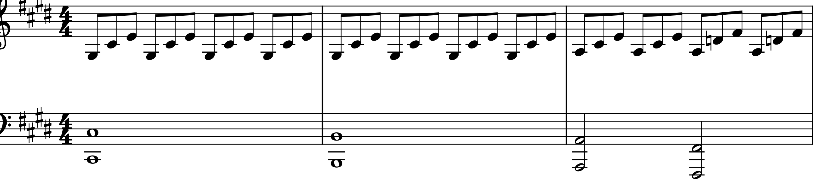

# Beethoven
## Piano Sonata [Which one?]

Beethoven is an important composer from the 18th century, but his music is not included in the history textbook.
Beethoven arrived in Vienna in 1792 at the age of 22, where he quickly gained recognition as an outstanding pianist and a promising composer.

*"Beethoven’s music activates fear, awe, horror, and suffering, awakening that “infinite longing” that defines the essence of Romanticism."(Hoffmann, 1813)*

This work is *Beethoven's Piano Sonata No. 14 in C♯ minor, Op. 27, No. 2*, commonly known as the **"Moonlight Sonata**."

In 1801, the year "Moonlight Sonata" was composed, Beethoven's hearing problems worsened, and his relationship with Giulietta Guicciardi faced difficulties. These personal struggles profoundly influenced his music, and "Moonlight Sonata" is one of the works where his emotions and turmoil are vividly expressed, earning it much admiration.
The title "Moonlight" was not given by Beethoven himself. It originated five years after his death when *Ludwig Rellstab* described the first movement as resembling **"a boat on the Lake Lucerne illuminated by moonlight."**

The first movement is in the key of C♯ minor and has a structure similar to sonata form, but it deviates significantly from the conventional sonata structure.
Unlike a typical sonata form that two themes are presented in the exposition, this movement uses a single theme that is continuously varied in pitch. 
Moreover, there are no complex techniques such as Beethoven's characteristic sudden changes in tempo or modulations.

Thus, due to the simple structure of the first movement, it is essential to truly feel and express the musical ideas above all else.
Beethoven included the instruction **"sostenuto"** in this piece, meaning that the notes should be played as expressively as possible, allowing them to be sustained fully.
Additionally, he added the comment in Italian: **"Si deve suonare tutto questo pezzo delicatissimamente e senza sordini,"** which means *"One must play this entire piece very delicately and without damper."*

Comment: It would be nice if there was an explanation for other movements besides the first movement.

Comments: The portrait and the score are too big. Make them smaller? Also, the file name must be changed.

Comment: The sheet music is a little short.

Comments: It would be nice to take the sample out of the title.
