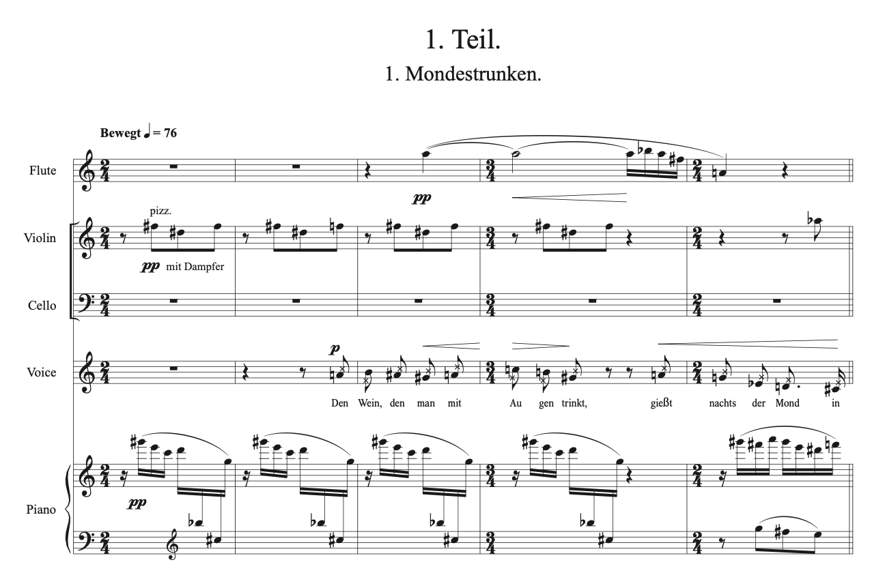

# Arnold Franz Walter Schönberg
## _Pierro Lunaire_'s Explanation

 Arnold Schoenberg (1874.09.13 – 1951.07.13) composed this song in 1912, based on 21 poems by Albert Giraud.

---

- [Timeline](#timeline)
- [Several Notable Features](#several-notable-features)
  - [1. Atonality](#1-atonality)
  - [2. Sprechstimme](#2-sprechstimme)
- [Instrumentation](#instrumentation)
- [Importance](#importance)
- [Questions for Review](#questions-for-review)
- [Guides for Further Studies](#guides-for-further-studies)

---

## Timeline

 | Year | Event        | Description                                       | YouTube                                                      |
 | ---- | ------------ | ------------------------------------------------- | -------------------------------------------------------------|
 | 1874 | Birth        | Born on September 13, 1874 in Bin, Vienna, Austria|                                                              |
 | 1894 | Early Work   | Zwei Lieder                                       | [Watch](https://www.youtube.com/watch?v=cSqhM9DPHr4) 📺       |
 | 1912 | Famous Work  | Pierrot Lunaire 😄                                | [Watch](https://youtu.be/vQVkbKULKpI?si=XpeT-0TYAx_oDjTn) 📺  | 

> The study of the friendship or personal relationship between [Gustav Mahler](https://github.com/hskye79/openmusichistory/blob/main/mahler-symphony.md) (1860-1911) and Arnold Schoenberg (1874-1951) initially began through primary sources such as the memoirs and letters of Mahler’s wife, Alma (1879-1964), as well as Schoenberg’s lectures. Since then, musicologists have focused on the friendship or musical influence between these composers. Through these documents, we learn that Schoenberg was initially not very friendly toward Mahler, but gradually came to respect him personally after their first meeting. Furthermore, it is evident that Mahler supported his younger colleague Schoenberg in various ways.

## Several notable features

Comments: It would be better to show this interesting features with the score and add what parts it is.

### 1. Atonality
Typically, music classified as “classical” or “popular” is tonal, meaning it adheres to a key center that emphasizes tonic and dominant relationships. However, Schoenberg avoided being confined to a specific key. Pierrot Lunaire exemplifies this approach. While it progresses without traditionalharmonic structures, it still conveys a strong sense of musicality. 

### 2. Sprechstimme
Similar to recitative but distinct, Sprechstimme is a unique technique that lies between singing and plain speech. It involves delivering the text in a speech-like manner while maintaining the pitch of each note.

---
## Instrumentation

> This work is composed for a chamber ensemble, creating a unique instrumental combination. The instruments used are as follows:

* Flute (including piccolo)
* Clarinet (including bass clarinet)
* Violin (including on viola)
* Cello
* Piano

---
## Importance
> He is an **influential figure** in 20th-century modern music, often associated with the Second Viennese School. His works explore new musical concepts, including “atonality” and the “twelve-tone technique.” Compared to Debussy, he is a pioneer of Expressionism and avant-garde music, an approach that later influenced Berg’s serialism.

---

## Questions for Review

1.	What are the characteristic elements of this piece?

2.	What method did schoenberg devise instead of functional tonality?

---

## Guides for Further Studies

If you’re curious about composer Lee Moon-hee, who is currently teaching Schoenberg’s serial music, refer to the following [link](moonheelee-The-Proliferation-of-Dots.md)
